# Garuda Sentinel — AI Agents Architecture

> Full architecture reference for the AI agents inside the Bank of India (BOI) Garuda Sentinel
> fraud-intelligence platform. This document maps how the **Fraud Investigation Agent**,
> the **Mule Intelligence subsystem**, the **COBOL Sentinel Agent**, and the supporting
> **LangGraph multi-agent orchestrator** are accessed, how their workflows run, how they use
> the **Groq LLM API**, what language each tier is written in, and how multi-step agentic
> processes are coordinated.

All diagrams below are [Mermaid](https://mermaid.js.org/) — they render natively on GitHub,
in VS Code (Markdown Preview Mermaid Support), and on most Markdown viewers.

---

## 1. System Context — Agents at a Glance

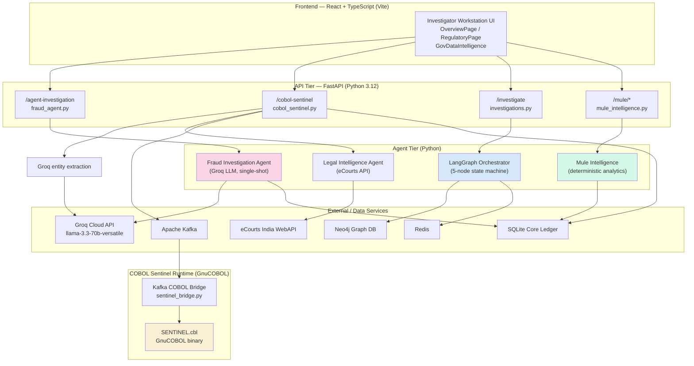

### Agent inventory & implementation language

| Agent / Subsystem | Language | LLM? | Access Path | Style |
|---|---|---|---|---|
| **Fraud Investigation Agent** | Python (FastAPI router) | ✅ Groq `llama-3.3-70b-versatile` | `POST /api/v1/agent-investigation/investigate` | Single-shot LLM report generation |
| **COBOL Sentinel Agent** | **COBOL** (GnuCOBOL) + Python bridge | ✅ Groq (entity extraction only) | `POST /api/v1/cobol-sentinel/intercept` | LLM extract → deterministic scoring → COBOL decision |
| **LangGraph Orchestrator** | Python (LangGraph) | ❌ (rule + ML based) | `POST /api/v1/investigate` | 5-node stateful multi-agent graph |
| **Mule Intelligence** | Python (SQLite analytics) | ❌ | `GET /api/v1/mule/*` | Deterministic graph/flow analytics |
| **Legal Intelligence Agent** | Python | ❌ (REST enrichment) | Invoked inside COBOL Sentinel | Quota-gated external API enrichment |

---

## 2. The Three Agentic Models Used

The platform deliberately uses **three different agentic patterns** depending on the trust and
determinism requirements of the task:

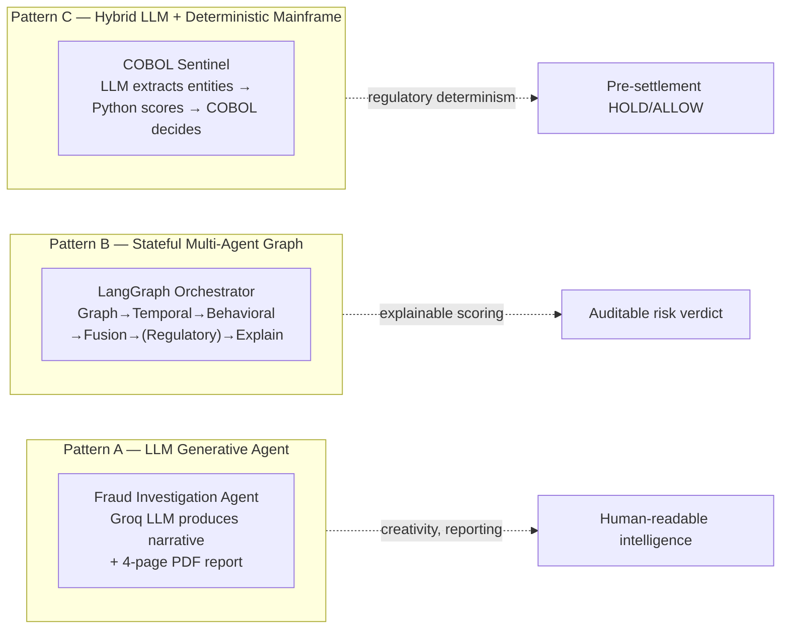

**Why three?** LLMs are non-deterministic — acceptable for *report writing* (Pattern A) and
*entity extraction* (Pattern C input), but **never** for the actual money-movement decision.
The final HOLD/FREEZE/ALLOW verdict is computed by deterministic Python scoring and a
**COBOL mainframe rules engine** (Pattern C), so the same ticket always yields the same
banking action — a regulatory requirement.

---

## 3. Fraud Investigation Agent (Groq LLM)

**File:** `src/api/routers/fraud_agent.py` · **Endpoint:** `POST /api/v1/agent-investigation/investigate`

This is the classic generative agent: it receives ML telemetry (GNN, LSTM, XGBoost SHAP,
graph neighbors) and uses the Groq LLM to author a professional executive report plus a
structured 4-page PDF.

### 3.1 Sequence Diagram

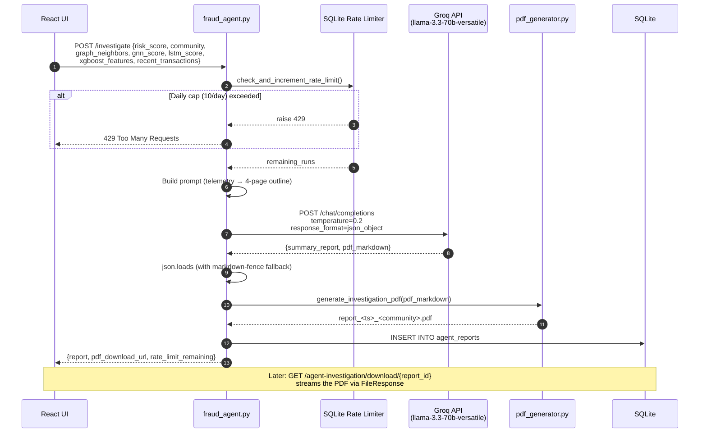

### 3.2 Groq API usage detail

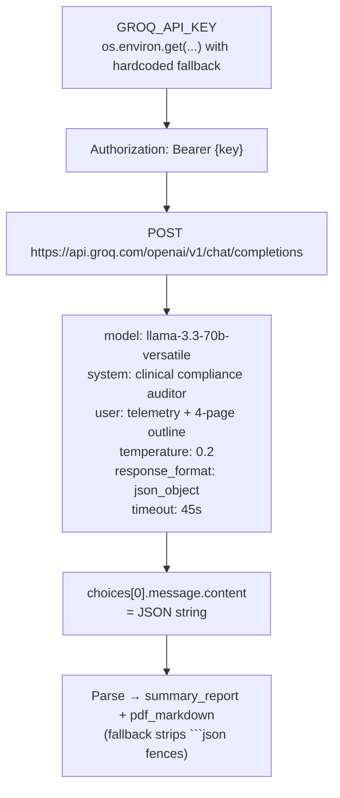

- **OpenAI-compatible REST** — Groq exposes the OpenAI chat-completions schema, so the code
  uses raw `requests.post`, no SDK.
- **Structured output** is forced via `response_format={"type":"json_object"}` and a strict
  two-key contract (`summary_report`, `pdf_markdown`).
- **Cost control:** absolute **10 runs/day** enforced in the `agent_rate_limit` SQLite table.

---

## 4. COBOL Sentinel Agent (Hybrid LLM → Python → Mainframe)

**Files:** `src/api/routers/cobol_sentinel.py`, `src/cobol/SENTINEL.cbl`,
`src/cobol/sentinel_bridge.py` · **Endpoint:** `POST /api/v1/cobol-sentinel/intercept`

This is the most sophisticated multi-step agent. It turns a free-text cybercrime ticket into a
pre-settlement banking decision through **8 deterministic stages**, using the LLM **only** to
parse entities out of natural language, and a real **GnuCOBOL** program for the final verdict.

### 4.1 End-to-End Multi-Step Workflow

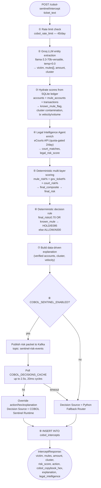

### 4.2 The Kafka ⇄ COBOL Runtime Loop

The Python router and the COBOL binary are decoupled processes connected by two Kafka topics.
A background daemon (`sentinel_bridge.py`) consumes risk events, shells out to the compiled
GnuCOBOL binary, and publishes decisions back.

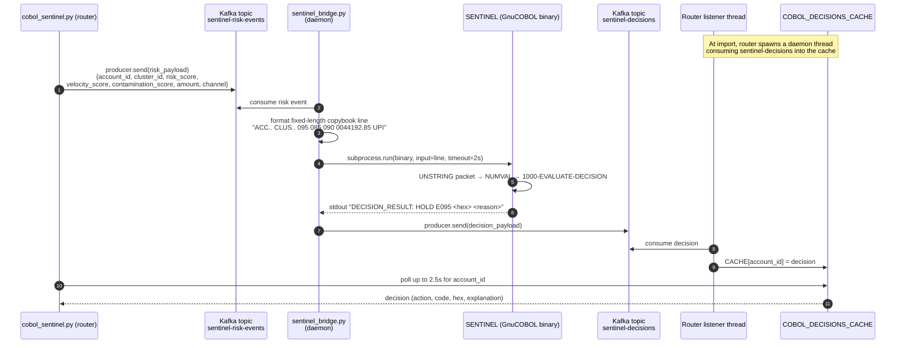

### 4.3 COBOL Decision Logic (`SENTINEL.cbl`)

The mainframe program is the deterministic core. It ingests a fixed-length copybook record from
`SYSIN`, parses it with `UNSTRING`/`NUMVAL`, and applies a cascading rule ladder.

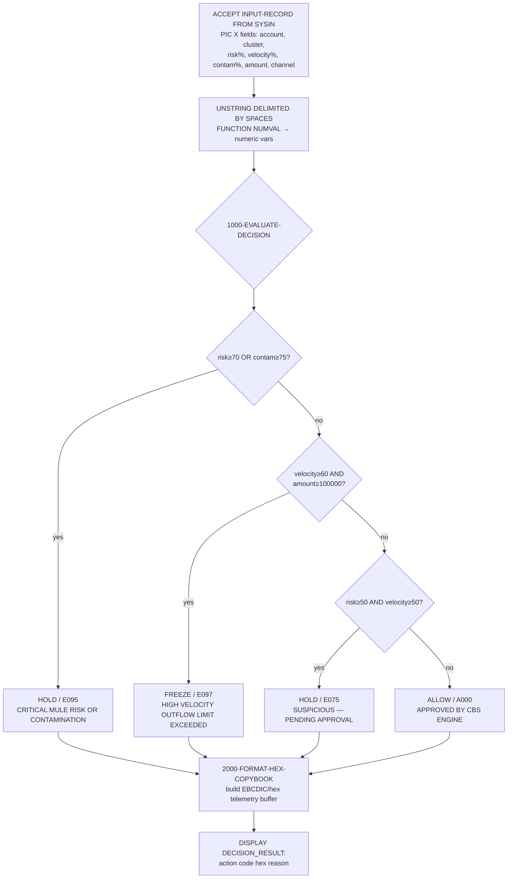

**Decision thresholds (working-storage constants):** `HIGH-RISK = 70`,
`CRITICAL-CONTAM = 75`, `ELEVATED-VELOCITY = 60`.

### 4.4 Groq usage in the COBOL Sentinel

Unlike the Fraud Investigation Agent, here Groq is used **purely as a parser** — `temperature=0.0`
for determinism — and never touches the money decision:

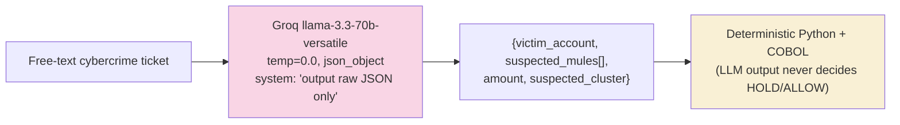

---

## 5. LangGraph Multi-Agent Orchestrator

**Files:** `src/agents/orchestrator.py`, `src/agents/*_agent.py`, `src/agents/state.py`
· **Endpoint:** `POST /api/v1/investigate`

This is the **stateful, multi-step agentic core** built on **LangGraph**. A shared
`FraudInvestigationState` (TypedDict) flows through five specialist agent nodes; each agent
mutates the state and passes it on. One conditional edge branches on the fused risk score.

### 5.1 Orchestration State Graph

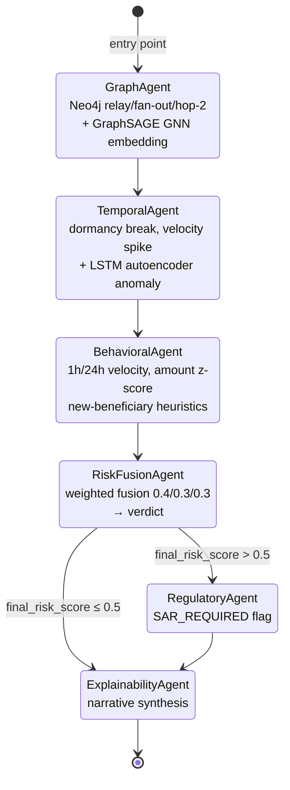

### 5.2 Shared State Object (passed between every node)

```mermaid
classDiagram
    class FraudInvestigationState {
        +str transaction_id
        +str account_id
        +Dict features
        +float graph_score
        +float temporal_score
        +float behavioral_score
        +List graph_findings
        +List temporal_findings
        +List behavioral_findings
        +Optional~List~ gnn_embedding
        +float final_risk_score
        +str final_verdict
        +str explanation_narrative
        +Optional~Dict~ shap_values
        +Dict metadata
    }

    class GraphAgent {
        +investigate(state) state
        -Neo4j driver
        -GraphSAGE GNN model
    }
    class TemporalAgent {
        +investigate(state) state
        -LSTM autoencoder
    }
    class BehavioralAgent {
        +investigate(state) state
        -Redis velocity cache
    }
    class RiskFusionAgent {
        +investigate(state) state
        -weights{graph,temporal,behavioral}
    }
    class ExplainabilityAgent {
        +investigate(state) state
    }

    GraphAgent ..> FraudInvestigationState : reads/writes
    TemporalAgent ..> FraudInvestigationState : reads/writes
    BehavioralAgent ..> FraudInvestigationState : reads/writes
    RiskFusionAgent ..> FraudInvestigationState : reads/writes
    ExplainabilityAgent ..> FraudInvestigationState : reads/writes
```

### 5.3 How each node scores (multi-step reasoning)

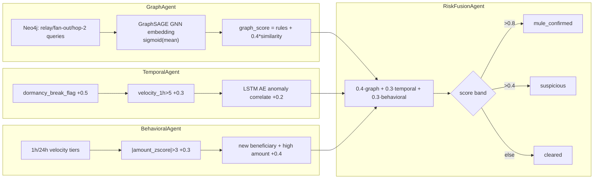

### 5.4 Async execution wiring

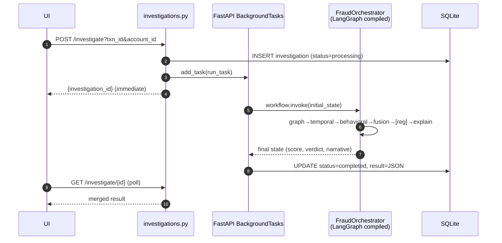

---

## 6. Mule Intelligence Subsystem (Deterministic Analytics)

**Files:** `src/mule_intelligence/*.py` · **Endpoints:** `GET/POST /api/v1/mule/*`

Not an LLM agent — a suite of deterministic graph/flow analytics over the SQLite ledger. It feeds
features into the other agents and powers the dashboards.

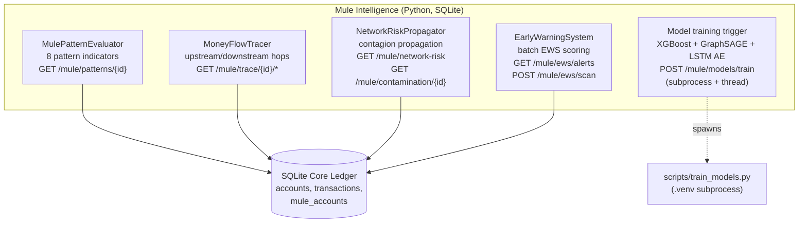

- **Model training** is launched as a background **subprocess** (`scripts/train_models.py`) under a
  daemon thread, streaming logs into an in-memory `training_state` polled via `GET /mule/models/status`.
- These analytics produce the `gnn_score`, `lstm_score`, and SHAP features later consumed by the
  Fraud Investigation Agent (§3).

---

## 7. Legal Intelligence Agent (External Enrichment)

**File:** `src/agents/legal_intelligence_agent.py` — invoked **inside** the COBOL Sentinel flow (§4, step ④).

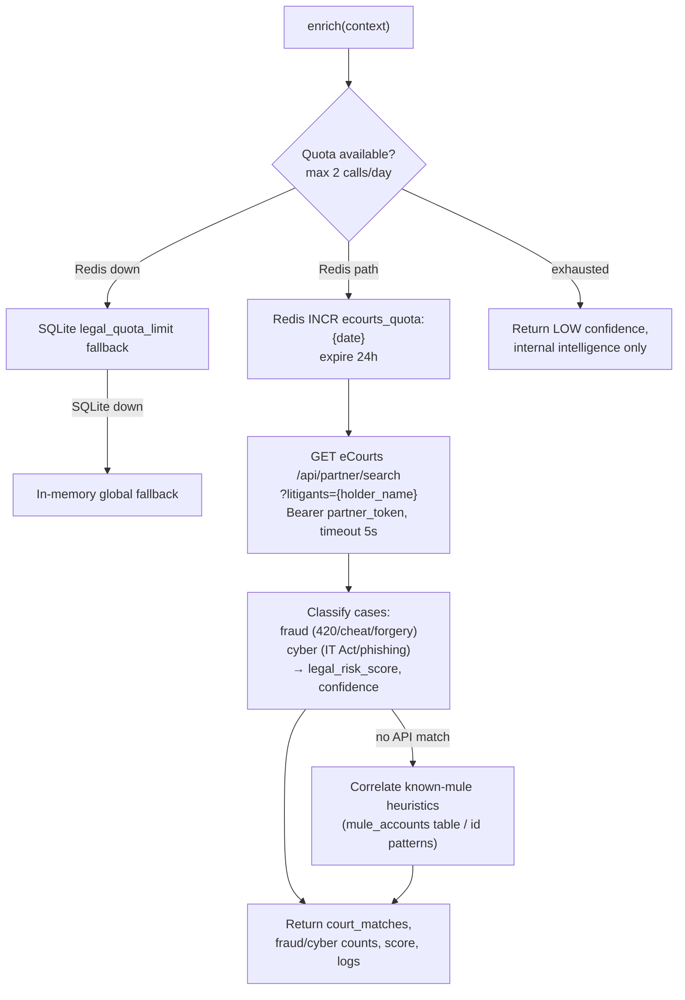

**Three-tier quota fallback** (Redis → SQLite → in-memory) keeps the agent resilient when
infrastructure is partially down, while strictly capping the paid eCourts API at 2 calls/day.

---

## 8. Cross-Cutting Concerns

### 8.1 Groq API integration summary

| Aspect | Fraud Investigation Agent | COBOL Sentinel (extraction) |
|---|---|---|
| Endpoint | `https://api.groq.com/openai/v1/chat/completions` | same |
| Model | `llama-3.3-70b-versatile` | `llama-3.3-70b-versatile` |
| Temperature | `0.2` (some creativity for prose) | `0.0` (deterministic parsing) |
| Output | `json_object` → `{summary_report, pdf_markdown}` | `json_object` → `{victim, mules, amount, cluster}` |
| Auth | `Authorization: Bearer {GROQ_API_KEY}` (env var + fallback) | same |
| Transport | raw `requests.post` (no SDK; OpenAI-compatible schema) | same |
| Timeout | 45s | 20s |
| Decision role | Writes the report | Parses entities only — **never decides** |

> ⚠️ **Security note:** both routers fall back to a **hard-coded `gsk_...` key** if `GROQ_API_KEY`
> is unset. This key is committed in source and should be moved to environment-only configuration
> and rotated.

### 8.2 Rate limiting / cost control across agents

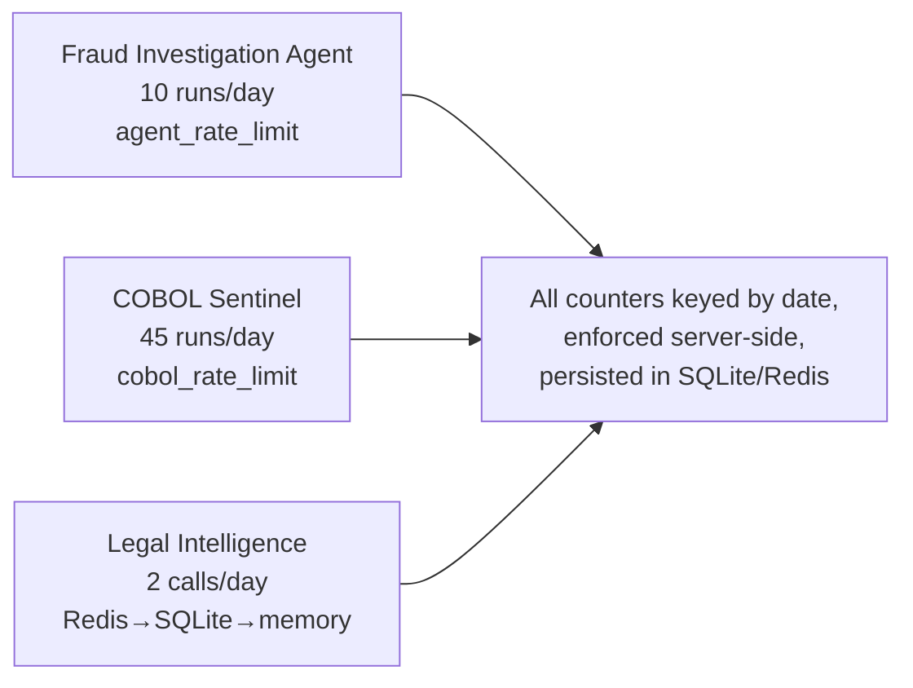

### 8.3 Multi-step agentic process — the unifying pattern

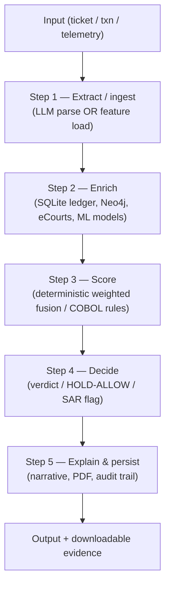

Every agent in the platform — generative, stateful-graph, or hybrid-mainframe — follows this same
**extract → enrich → score → decide → explain** spine. The key architectural discipline is that
**LLMs participate only in the extract and explain steps**, while **scoring and deciding remain
deterministic** (Python fusion + COBOL rules), guaranteeing auditable, reproducible banking actions.

---

## 9. File Reference Map

| Concern | File |
|---|---|
| LangGraph orchestrator | `src/agents/orchestrator.py` |
| Shared agent state | `src/agents/state.py` |
| Specialist agents | `src/agents/{graph,temporal,behavioral,risk_fusion,explainability}_agent.py` |
| Legal Intelligence Agent | `src/agents/legal_intelligence_agent.py` |
| PDF report generator | `src/agents/pdf_generator.py` |
| Fraud Investigation Agent (Groq) | `src/api/routers/fraud_agent.py` |
| COBOL Sentinel router (Groq + Kafka) | `src/api/routers/cobol_sentinel.py` |
| COBOL Kafka bridge daemon | `src/cobol/sentinel_bridge.py` |
| COBOL rules engine | `src/cobol/SENTINEL.cbl` |
| Investigation API | `src/api/routers/investigations.py` |
| Mule Intelligence API | `src/api/routers/mule_intelligence.py` |
| Mule analytics modules | `src/mule_intelligence/{patterns,money_flow_tracer,network_scorer,early_warning}.py` |
| SQLite data bridge | `src/pipeline/cobol_bridge.py` |
| Router registration | `src/api/main.py` |
```
