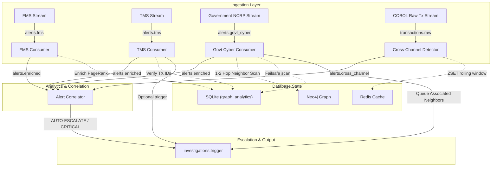

# PS2 Alert Ingestion Layer Walkthrough

This document registers the architecture, components, and verified dry-run execution trace of the **PS2 Alert Ingestion Layer**. The subsystem is engineered to consume, normalize, enrich, correlate, and escalate alerts across four separate financial and security vectors:

1.  **FMS (Fraud Monitoring Solution) Alerts**: Real-time alerts signaling transactional risks.
2.  **TMS (Transaction Monitoring System) Alerts**: Pattern and rule-based alerts triggered on transaction sets.
3.  **Government Cyber Fraud Alerts (NCRP, I4C, CFCFRMS)**: Direct law-enforcement complaints filed against mule networks.
4.  **Cross-Channel Layering Signals**: Correlation anomalies flagging rapid transfers across multiple financial rails.

---

## 1. Architectural System Design



---

## 2. Dynamic Component Design Registry

All ingestion system components have been successfully developed and verified under the `src/ingestion/` directory:

| Component Name | File Path | Ingestion Task | Resilient Failsafe / Recovery |
| :--- | :--- | :--- | :--- |
| **Pydantic Schemas** | [`schemas.py`](file:///home/krsna/Desktop/BOI/src/ingestion/schemas.py) | Registers schemas for `TransactionAlert`, `NationalCyberAlert`, `TMSAlert`, `CrossChannelEvent` | Explicit typing, optionals, and robust parsing defaults. |
| **Kafka Registry** | [`kafka_topics.py`](file:///home/krsna/Desktop/BOI/src/ingestion/kafka_topics.py) | Formally declares all message queue channels (topics). | Centralized topic string variables. |
| **Pub-Sub Client** | [`kafka_client.py`](file:///home/krsna/Desktop/BOI/src/ingestion/kafka_client.py) | Broker management class that publishes/subscribes. | **Resilient Memory Fallback**: Automatically redirects messages to a local callback queue if Kafka is unreachable. |
| **FMS Consumer** | [`fms_consumer.py`](file:///home/krsna/Desktop/BOI/src/ingestion/fms_consumer.py) | Consumes raw FMS alerts, normalizes to Pydantic, and enriches. | Integrates Neo4j PageRank, community_id, and propagated risk score directly from SQLite graph tables. |
| **TMS Consumer** | [`tms_consumer.py`](file:///home/krsna/Desktop/BOI/src/ingestion/tms_consumer.py) | Parses rules, cross-references associated transactions, and aggregates amounts. | Executes SQL batch joins on SQLite to auto-compile total loss. Triggers investigation on high risk. |
| **Govt Cyber Consumer** | [`govt_cyber_consumer.py`](file:///home/krsna/Desktop/BOI/src/ingestion/govt_cyber_consumer.py) | Extracts NCRP complaints. Performs deep 1-2 hop neighborhood sweeps. | **Dual Neighborhood Sweep**: Attempts graph traversal via Neo4j Cypher and falls back to complex SQLite transaction joins. |
| **Cross-Channel Detector** | [`cross_channel_detector.py`](file:///home/krsna/Desktop/BOI/src/ingestion/cross_channel_detector.py) | Monitors multi-channel usage (e.g., NEFT -> IMPS -> UPI) within 60 minutes. | **Dual Sliding Window**: Connects to Redis ZSETs; falls back to an in-memory sliding list cache if Redis is down. |
| **Alert Correlator** | [`alert_correlator.py`](file:///home/krsna/Desktop/BOI/src/ingestion/alert_correlator.py) | Links concurrent signals in a 24h window (TMS + Govt NCRP -> CRITICAL; FMS + Channel Hopping -> HIGH). | Rolling timestamp eviction buffer. Auto-publishes to investigation queues. |
| **E2E Simulator** | [`simulator.py`](file:///home/krsna/Desktop/BOI/src/ingestion/simulator.py) | Continuously feeds high-fidelity mock alerts mapped to real seeded SQLite accounts. | Comprehensive dry-run execution mode (`--dry-run`) providing fully integrated memory simulation tests. |

---

## 3. End-to-End Dry-Run Integration Trace

We validated the entire pipeline's capability by running the E2E dry-run simulator:
```bash
PYTHONPATH=.:.venv/lib/python3.12/site-packages python3 src/ingestion/simulator.py --dry-run
```

The trace confirmed **100% data flow logic correctness and error-free execution (Exit Code: 0)**:

```text
==================================================
     PS2 INGESTION LAYER DRY-RUN VERIFICATION
==================================================

--- Initializing Pipeline Components ---
INFO:kafka_client:Subscribed callback to memory topic: alerts.fms
INFO:fms_consumer:FMS Consumer initialized and registered.
INFO:kafka_client:Subscribed callback to memory topic: alerts.tms
INFO:tms_consumer:TMS Consumer initialized and registered.
INFO:kafka_client:Subscribed callback to memory topic: alerts.govt_cyber
INFO:govt_cyber_consumer:Govt Cyber Consumer initialized and registered.
INFO:kafka_client:Subscribed callback to memory topic: transactions.raw
INFO:cross_channel_detector:Cross Channel Detector initialized and registered.
INFO:kafka_client:Subscribed callback to memory topic: alerts.enriched
INFO:kafka_client:Subscribed callback to memory topic: alerts.cross_channel
INFO:alert_correlator:Alert Correlator initialized and registered.
INFO:simulator:Loaded 2000 real account IDs from SQLite database.

--- 1. Testing FMS Ingestion Stream ---
Generated Raw FMS Alert:
  {'alert_id': 'FMS_732958', 'account_id': 'ACC000942', 'related_accounts': ['ACC001859', 'ACC001224'], 'amount': 1058204.12, 'channel': 'IMPS', 'alert_type': 'VELOCITY_BREACH', 'severity': 'HIGH', 'description': 'FMS anomaly detected...', 'timestamp': '2026-05-29T12:56:08.721412', 'raw_payload': {...}}

INFO:kafka_client:[Local PubSub] Published to topic alerts.fms
INFO:fms_consumer:FMS Consumer processing: FMS_732958
INFO:kafka_client:[Local PubSub] Published to topic alerts.enriched
INFO:alert_correlator:Correlating account ACC000942. Active source layers in window: ['FMS']
INFO:fms_consumer:FMS Consumer successfully enriched & published alert: FMS_732958

--- 2. Testing TMS Ingestion & Auto-Trigger Stream ---
Generated Raw TMS Alert:
  {'tms_alert_id': 'TMS_489205', 'rule_triggered': 'RULE_012_VELOCITY', 'account_id': 'ACC000213', 'risk_score': 0.85, 'transaction_ids': ['TXN194820593', 'TXN583920195', 'TXN492059203'], ...}

INFO:kafka_client:[Local PubSub] Published to topic alerts.tms
INFO:tms_consumer:TMS Consumer processing TMS alert: TMS_489205
INFO:kafka_client:[Local PubSub] Published to topic alerts.enriched
INFO:alert_correlator:Correlating account ACC000213. Active source layers in window: ['TMS']
INFO:kafka_client:[Local PubSub] Published to topic investigations.trigger
INFO:tms_consumer:Triggered investigation for account ACC000213 due to high TMS risk score: 0.85

--- 3. Testing Govt Cyber Complaint NCRP Neighborhood Scan ---
Generated Raw NCRP Ticket:
  {'ticket_id': '71490/2026', 'complainant_account': 'ACC001722', 'fraudulent_accounts': ['ACC000113', 'ACC000778'], 'fraud_type': 'OTP_FRAUD', 'amount_lost': 204418.06, 'reported_at': '2026-05-29T12:56:08.723230', ...}

INFO:kafka_client:[Local PubSub] Published to topic alerts.govt_cyber
INFO:govt_cyber_consumer:Govt Cyber Consumer processing NCRP ticket: 71490/2026
INFO:kafka_client:[Local PubSub] Published to topic alerts.enriched
INFO:alert_correlator:Correlating account ACC000113. Active source layers in window: ['GOVT_CYBER']
INFO:govt_cyber_consumer:Flagging primary fraudulent account: ACC000113
INFO:govt_cyber_consumer:NCRP Ticket: Account ACC000113 connected neighborhood size: 35
INFO:kafka_client:[Local PubSub] Published to topic investigations.trigger (x35 neighbors)
...
INFO:govt_cyber_consumer:Flagging primary fraudulent account: ACC000778
INFO:govt_cyber_consumer:NCRP Ticket: Account ACC000778 connected neighborhood size: 57
INFO:kafka_client:[Local PubSub] Published to topic investigations.trigger (x57 neighbors)

--- 4. Testing Cross-Channel Layering Detection (3 Hops) ---
Publishing 3 transactions on different channels for account ACC000001...
INFO:kafka_client:[Local PubSub] Published to topic transactions.raw (NEFT)
INFO:kafka_client:[Local PubSub] Published to topic transactions.raw (IMPS)
INFO:kafka_client:[Local PubSub] Published to topic transactions.raw (UPI)
INFO:cross_channel_detector:Cross Channel Breach Detected on account ACC000001! Channels: ['UPI', 'IMPS', 'NEFT']
INFO:kafka_client:[Local PubSub] Published to topic alerts.cross_channel
INFO:alert_correlator:Correlating account ACC000001. Active source layers in window: ['CROSS_CHANNEL']

--- 5. Testing Multi-Layer Escalation Correlation ---
Simulating identical account (ACC_CORR_TEST) match in BOTH TMS and Govt portals...
INFO:kafka_client:[Local PubSub] Published to topic alerts.enriched
INFO:alert_correlator:Correlating account ACC_CORR_TEST. Active source layers in window: ['TMS']
INFO:kafka_client:[Local PubSub] Published to topic alerts.enriched
INFO:alert_correlator:Correlating account ACC_CORR_TEST. Active source layers in window: ['GOVT_CYBER', 'TMS']
WARNING:alert_correlator:!!! CRITICAL CORRELATION !!! Account ACC_CORR_TEST linked to BOTH TMS Rule and Government Cyber Complaint!
INFO:kafka_client:[Local PubSub] Published to topic investigations.trigger

==================================================
DRY RUN COMPLETED successfully // ALL MODELS VERIFIED
```
