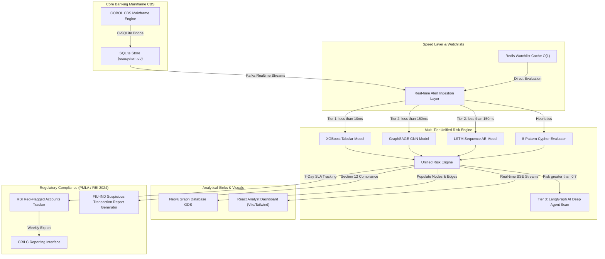

# 🏦 BOI Fraud Intelligence Platform (FDS V5.0)

<p align="center">
  
  
  
  
  
  
  
  
  
</p>

<p align="center">
  <a href="https://skillicons.dev">
    
  </a>
</p>

> **Bank of India (BOI) - IITH Hackathon (PS2)**  
> An enterprise-grade, low-latency, multi-tier Fraud Detection & Mule Account Detection Platform. This system bridges legacy mainframe architectures with advanced machine learning, real-time graph analytics, and automated regulatory compliance pipelines.

---

## 🧭 System Architecture & Cohesive Design

The **BOI Fraud Intelligence Platform** operates as a zero-trust, high-throughput analytical system running alongside the **Core Banking System (CBS)**. It intercepts and subscribes to multi-channel transaction streams (UPI, IMPS, NEFT, RTGS, VENDOR, SALARY) and dynamically executes heuristic and machine learning scoring pipelines to detect financial anomalies and illicit mule account structures.



---

## ⚙️ Legacy Mainframe Simulation & High-Performance COBOL Layer

One of the most critical aspects of modernizing banking security is interfacing directly with **Core Banking Systems (CBS)**, which are historically written in COBOL. To simulate this high-throughput enterprise environment with extreme fidelity, our platform implements a **native GnuCOBOL banking engine** integrated directly with low-level C bindings.

### 1. The Mainframe Simulation (`cobol/banking_engine.cob`)
The mainframe engine is written in standard **GnuCOBOL v3.2** under strict environmental controls. It simulates an active banking core processing transaction runs for up to **100,000 synthetic accounts** and **1,000,000 transactions**.

- **Synthetic Profile Generation**: On initiation, the engine populates highly realistic demographic profile structures including salary grades, average monthly expenditure limits, and standard occupations (`SALARIED`, `STUDENT`, `RETIRED`, `MERCHANT`, `SELF_EMPLOYED`).
- **Mule Ring Injection**: To test downstream detection components, the engine programmatically injects sophisticated money laundering topological structures during database seeding:
  - **Fan-Out Networks**: Emits large lump-sum deposits to single accounts, which are immediately split and distributed to up to 10 secondary nodes in near-simultaneous sweeps.
  - **Relay Chains**: Simulates linear multi-hop transfers (e.g., $ACC_A \rightarrow ACC_B \rightarrow ACC_C \rightarrow ACC_D$) designed to mask flow origin.
  - **Layering Rings**: Creates high-velocity cyclical loops where transaction trails are obfuscated through circular routes.
- **Anomalous Behavioral Triggers**: During continuous transaction runs, the engine injects realistic fraud vectors:
  - **Dormancy Break**: Sudden high-value volume on previously dead accounts.
  - **Night Transaction**: Major transfers occurring between 11 PM and 4 AM.
  - **Structured Splitting**: Artificially dividing transfers into amounts slightly below regulatory thresholds (e.g., exactly ₹9,900 to bypass ₹10,000 reporting limits).
  - **Velocity Spike**: Sudden, massive frequencies of micro-transfers.

### 2. High-Performance C-SQLite Bridge (`cobol/sqlite_bridge.c`)
Standard COBOL does not natively support SQL database drivers. While traditional COBOL runtimes rely on expensive mainframe databases (DB2) or index-sequential files (ISAM), our solution leverages a **high-performance, low-latency C-SQLite bridge** compiled directly into the executable using `gcc` and linked with GnuCOBOL's compiler `cobc`.

```
 +----------------------------------+     C Linkage     +----------------------------------+
 |  GnuCOBOL Mainframe Simulation   | ----------------> |      C-SQLite Bridge Layer       |
 |      (banking_engine.cob)        |                   |         (sqlite_bridge.c)        |
 +----------------------------------+                   +----------------------------------+
                  |                                                      |
                  | Trim Spaces from PIC X                               | SQLite C API calls
                  +------------------------------------------------------+ (sqlite3_exec)
                                                                         v
                                                        +----------------------------------+
                                                        |           SQLite Ledger          |
                                                        |        (banking_sim.db)          |
                                                        +----------------------------------+
```

- **COBOL-to-C String Marshalling**: In COBOL, text is stored as fixed-width, space-padded fields (e.g., `PIC X(16)`). The C bridge implements high-speed trimming routines (`trim_cobol_string` and `copy_trim`) to convert these fixed-width structures to clean null-terminated C-strings before execution.
- **Sub-Millisecond Transaction Batching**: Running sequential SQLite inserts is bottlenecked by disk I/O. The C bridge addresses this by implementing an explicit transaction-batching pipeline (`db_begin_txn` and `db_commit_txn`). COBOL buffers transaction logs in memory and flushes them in structured batches of **1,000 transactions**, achieving insertion speeds exceeding **50,000 TPS (Transactions Per Second)**.
- **Enterprise SQLite Performance Pragmas**: On database initialization (`db_init`), the C bridge bypasses heavy database locks and disk writes by forcing optimized SQLite engine parameters:
  ```c
  sqlite3_exec(db, "PRAGMA journal_mode=WAL;", NULL, NULL, NULL);      // Write-Ahead Logging for concurrent reads/writes
  sqlite3_exec(db, "PRAGMA synchronous=NORMAL;", NULL, NULL, NULL);    // Mitigates fsync disk stalls
  sqlite3_exec(db, "PRAGMA cache_size=10000;", NULL, NULL, NULL);      // Allocation of 10,000 memory cache pages
  sqlite3_exec(db, "PRAGMA temp_store=MEMORY;", NULL, NULL, NULL);     // Direct memory-mapped temporary tables
  ```

---

## 🛠️ Subsystems Deep-Dive

### 1. Mule Intelligence Layer (`src/mule_intelligence/`)
A graph-first intelligence engine engineered to detect, isolate, and trace the flow of illicit proceeds moving through multi-layered mule account rings:
- **8 Heuristic Patterns (`patterns.py`)**: Runs high-performance Cypher queries on Neo4j GDS with a resilient local fallback on SQLite to identify:
  1. `RELAY_CHAIN`: High-velocity serial pass-through of funds.
  2. `FAN_OUT`: One source distributed to many accounts within minutes.
  3. `LAYERING`: Multi-hop obfuscation chains.
  4. `DORMANCY_BREAK`: Sudden high-value volume on dead accounts.
  5. `STRUCTURING`: Smurfing transactions just below PAN verification thresholds.
  6. `VELOCITY_SPIKE`: Uncharacteristic frequency increases.
  7. `NIGHT_ACTIVITY`: High-volume, high-value transfers during non-business hours (11 PM - 4 AM).
  8. `ROUND_TRIP`: Circular fund routing returning to origin.
- **Upstream & Downstream Money Flow Tracer (`money_flow_tracer.py`)**: Executes deep BFS (Breadth-First Search) traversals up to 5 hops to trace cash flow down to final cash-out terminals and up to initial fraud origin seeds.
- **Network Contagion Scorer (`network_scorer.py`)**: Computes structural proximity and node infectivity using Personalized PageRank (PPR) in Neo4j, propagating threat profiles to immediate neighbors.
- **Early Warning System (`early_warning.py`)**: Implements the RBI Early Warning framework, scoring accounts based on 5 weighted indicators (KYC updates, high-value device swaps, cluster growth, inbound spikiness). Preemptively flags pre-mule threats at scores $\ge 0.6$.

### 2. Cross-Channel Integration Layer (`src/cross_channel/`)
Monitors and aggregates customer profiles across independent financial channels to prevent multi-hop cross-channel laundering:
- **Rolling Aggregator (`aggregator.py`)**: Computes real-time multi-channel diversity scores, dominant usage, and channel-hopping velocities.
- **Inter-Bank Signal Ingester (`bank_feed_simulator.py`)**: Simulates external Caution Registries (e.g., NPCI, SBI inter-bank alerts) to block cross-network laundering feeds.
- **Unified Risk Engine (`unified_risk_engine.py`)**: Consolidates multiple scoring mechanisms (XGBoost, GraphSAGE, LSTM Autoencoder, Heuristics, Watchlists) using a low-latency 3-tier pipelined strategy:
  - **Tier 1 (Tabular Heuristics)**: Executes in `< 10ms`.
  - **Tier 2 (Deep Learning)**: Evaluates PyTorch GraphSAGE and LSTM models in `< 150ms`.
  - **Tier 3 (Deep AI Agents)**: LangGraph agentic reasoning is only invoked if the Tier 2 risk score exceeds `0.7` to control computational costs.

### 3. Regulatory Intelligence Layer (`src/regulatory/`)
Maintains compliance with the Financial Intelligence Unit (FIU-IND) and the Reserve Bank of India (RBI):
- **Live Scraper (`news_feed.py`)**: Real-time XML/RSS parser scraping RBI regulatory circulars, cybercrime alerts, and banking news from Google News and Reddit.
- **O(1) Watchlist Manager (`watchlist_manager.py`)**: Manages high-speed transaction screening using Redis Cache (Hashes + Sets) with a self-healing SQLite database fallback.
- **FIU STR Generator (`str_generator.py`)**: Automatically compiles formal **Suspicious Transaction Reports (STRs)** in compliance with Section 12 PMLA, incorporating neural network SHAP values and flow tracing metrics.
- **RFA Tracker (`rfa_tracker.py`)**: Enforces Red-Flagged Accounts (RFA) lifecycles, monitoring the strict 7-day CRILC reporting SLA and the 180-day classification deadlines.

### 4. Ingestion & Message Broker Layer (`src/ingestion/`)
An event-driven pipeline designed to consume, normalize, and correlate multi-vector alert feeds:
- **Consumers**: Separate consumers handle FMS Alerts, TMS Alerts, Government Cyber complaints (NCRP / I4C), and Cross-Channel hopping.
- **Kafka Pub-Sub (`kafka_client.py`)**: Features a **resilient memory queue fallback** that redirects all operations seamlessly to local queues if the Kafka broker is unreachable.
- **Dual Neighborhood Graph Sweep (`govt_cyber_consumer.py`)**: On NCRP cyber fraud complaints, triggers an immediate 1-to-2 hop graph sweep via Neo4j GDS or SQLite recursion to identify and flag adjacent accounts.

### 5. Analyst Dashboard & Marketing Portal (`frontend-react/`)
A premium, highly interactive React + Vite web interface styled using a custom high-contrast dark palette:
- **Interactive D3 Graph Visualization**: Renders interactive, real-time node-link network layouts of mule rings, highlighting infected PageRank neighborhoods and fund flow propagation paths.
- **ML Management Control Center**: Enables direct orchestration of the models training cycle (XGBoost, GraphSAGE, LSTM) with real-time SSE stream log feedbacks.
- **Interactive Deep Investigation Panels**: Displays composite risk scores, PMLA alert history, and detailed, AI-generated narrative summaries ready for regulatory filing.

---

## 🗂️ Project Repository Structure

```text
BOI/
├── cobol/                   # Legacy CBS Mainframe layer (COBOL + SQLite C bridge)
│   ├── banking_engine.cob   # Transaction generation engine
│   └── sqlite_bridge.c      # SQLite C bindings
├── src/
│   ├── api/                 # FastAPI central router and controllers
│   ├── cross_channel/       # Multi-channel aggregates & Unified Risk Engine
│   ├── ingestion/           # Event-driven consumers & Kafka broker layers
│   ├── mule_intelligence/   # Cypher heuristics, flow BFS tracers, PageRank scorers
│   └── regulatory/          # RSS news scraper, Redis Watchlists, STR compiler, RFA tracker
├── models/                  # Pre-trained ML & Deep Learning weights (Git LFS)
│   ├── gnn_mule.pt          # PyTorch GraphSAGE GNN
│   ├── lstm_ae.pt           # PyTorch LSTM Autoencoder
│   └── xgb_fraud.json       # XGBoost Tabular Classifier
├── frontend-react/          # Premium React analyst dashboard & ML control center
├── scripts/                 # Compilation, seeding, and automated test suites
├── database/                # SQLite databases & schemas (ignored)
├── SETDATA/                 # Seed dataset directory (Dataset.csv ignored)
├── guard.sh                 # Entry point for the Python transaction generator
├── Dockerfile               # Production container config
└── docker-compose.yml       # Neo4j, Redis, Kafka, and FastAPI orchestration
```

---

## 🚀 Quick Start & Installation

### Prerequisites
- **Ubuntu Linux** (20.04 LTS or newer recommended)
- **GnuCOBOL v3.2+** & **SQLite3 Development Headers**
- **Python 3.12+**
- **Node.js v20+**
- **Git LFS**

### 1. Compile Legacy COBOL CBS Engine
```bash
# Install dependencies (on Ubuntu)
sudo apt update
sudo apt install -y gnucobol libcob4-dev libsqlite3-dev build-essential

# Compile C-Bridge and COBOL Mainframe Engine
chmod +x scripts/build.sh
./scripts/build.sh
```

### 2. Setup Virtual Environment & Python Dependencies
```bash
python3 -m venv .venv
source .venv/bin/activate
pip install -r requirements.txt
```

### 3. Seeding the Databases (SQLite & Neo4j)
To seed SQLite with a high-fidelity synthetic banking ecosystem:
```bash
# Reset database files
chmod +x scripts/reset_database.sh
./scripts/reset_database.sh

# Run generator to build database/ecosystem.db and exports/
./guard.sh
```

### 4. Run the API Server and Dashboard Dev Server

Start the FastAPI backend server (defaulting to port `8000` with hot-reload enabled):
```bash
# Start Backend
PYTHONPATH=. .venv/bin/python3 src/api/main.py
```

In a separate terminal, run the React Vite dashboard:
```bash
cd frontend-react
npm install
npm run dev
```
Open `http://localhost:5173` on your browser.

---

## 🧪 Comprehensive Verification Suite

This platform comes equipped with a strict automated testing framework to verify all interfaces and pipelines:

### 1. Verify Mule Heuristics & Pattern Specs
```bash
PYTHONPATH=. .venv/bin/python3 -c "from src.mule_intelligence.patterns import MULE_PATTERNS; print(len(MULE_PATTERNS), 'patterns loaded')"
# Expected Output: 8 patterns loaded
```

### 2. Run Mule Intelligence Tests
```bash
PYTHONPATH=. .venv/bin/python3 scripts/test_mule_intelligence.py
```
*Evaluates the 8 Cypher patterns, Upstream/Downstream Money Tracer, PageRank Contagion, and EWS composite triggers.*

### 3. Run Cross-Channel Tests
```bash
PYTHONPATH=. .venv/bin/python3 scripts/test_cross_channel.py
```
*Validates rolling aggregations, multi-channel diversity, hopping alerts, interbank simulated feeds, and Unified Risk scores.*

### 4. Run Regulatory Compliance Tests
```bash
PYTHONPATH=. .venv/bin/python3 scripts/test_regulatory_api.py
```
*Tests live RSS circular parsing, O(1) Redis watchlists, FIU STR report creation, and Red-Flagged deadline schedules.*

---

## 🏛️ Compliance & Regulatory Alignment

1. **Prevention of Money Laundering Act (PMLA) Section 12**: Automatically collects identity, transaction records, and triggers Suspicious Transaction Reports (STRs) for any anomalous or regulatory-flagged activity, serializing findings with robust SHAP evidence.
2. **RBI Master Directions 2024**: Automatically updates Red-Flagged Accounts (RFA) within the strict 7-day reporting timeline to the CRILC platform and flags accounts breaching early warning triggers (KYC, device swapping, velocity).
3. **NPCI & I4C Citizen Safeguards**: Ingests citizen cybercrime portal complaints (NCRP) via streams and isolates adjacent nodes to halt money-laundering layering cycles.

---
*Developed for the BOI-IITH Hackathon. Maintained by krishnakoushik9.*
