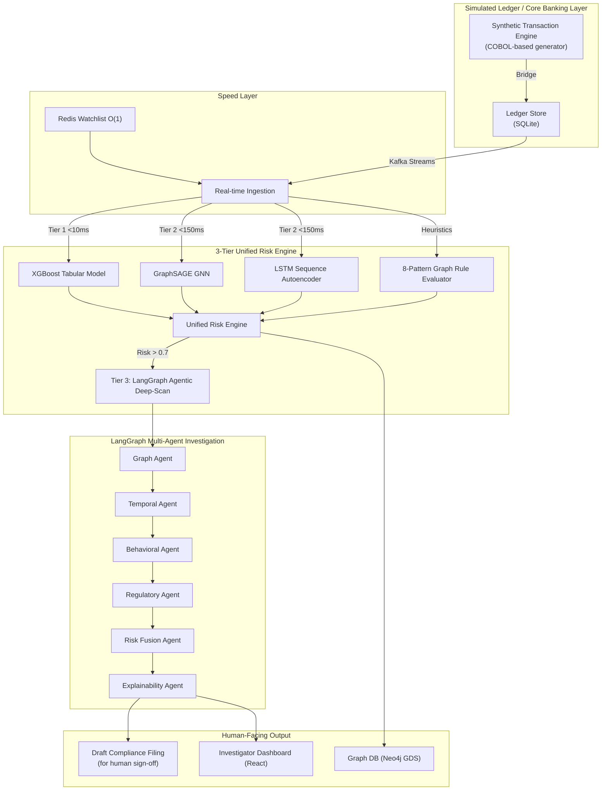
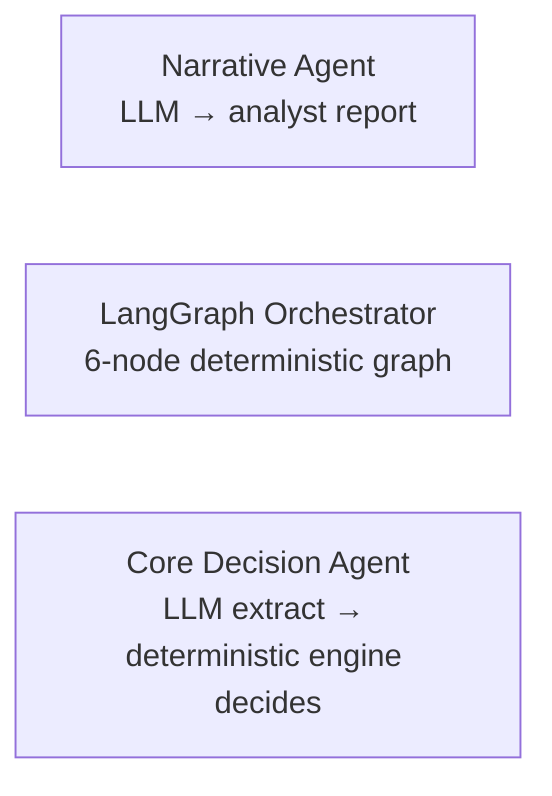

# 🦅 Garuda Sentinel- AI Risk Manager for Fraud & Mule Networks

<p align="center">
  
  
</p>

<p align="center">
  
  
  
  
  
  
  
  
</p>

> **Built for the [Razorpay AI Buildathon](https://razorpay.com/buildathon/)- Track 02, AI Risk Manager.**
> A working detector for mule-account and transaction-fraud loss, running against a
> self-generated, labeled synthetic banking environment- so precision/recall and
> false-positive cost are measurable, not asserted.

---

## ⚡ TL;DR (read this first, judges- everything below backs it up)

- **Problem**: money-mule networks and structured fraud are a defined loss category
  (Track 02) that costs merchants and banks real money through chargebacks, laundering, and
  undetected relay/fan-out schemes.
- **What it does**: ingests transactions in real time → scores every one through a 3-tier
  pipeline (rules → ML/graph models → agentic deep-scan) → outputs a verdict
  (`cleared` / `suspicious` / `mule_confirmed`) with a full explainable audit trail.
- **How it's tested**: a self-contained synthetic banking simulator injects *known* fraud
  topologies (fan-out, relay chains, layering rings, structuring, etc.) as ground truth, so
  precision/recall/false-positive cost can be computed on held-out data instead of eyeballed.
  See [Evaluation & Metrics](#-evaluation--metrics) for how to reproduce numbers on your own run.
- **Why agentic, not just a classifier**: the expensive, reasoning-heavy multi-agent
  investigation only runs on the ~5–10% tail that clears a real risk threshold- this is the
  concrete lever that keeps false-positive investigation cost bounded, which is exactly what
  Track 02 asks builders to report honestly.
- **Defense-only**: nothing in this repo initiates a transfer, contacts a third party, or
  takes retaliatory action. It scores, traces, and drafts filings for a human. Full statement
  in [Defense-Only Guarantee](#️-defense-only-guarantee).

---

## 🎯 Scoring against the Track 02 bar

| The Bar (Track 02- AI Risk Manager) | What Garuda Sentinel Ships |
|---|---|
| A working detector/verifier for **one class of loss** | Mule-account & fraud-ring detection: 8 Cypher heuristics + XGBoost + GraphSAGE GNN + LSTM autoencoder + Isolation Forest, fused into one verdict |
| **Measured precision & recall** on a held-out test set | Calibrated XGBoost, stacking/voting ensembles, evaluated against a synthetic ledger with *injected, labeled* fraud topologies (not scraped/assumed labels)- see reproduction steps below |
| **Honest false-positive cost** | 3-tier gated pipeline (`<10ms` → `<150ms` → agentic deep-scan only above a 0.7 risk threshold)- this is the FP-cost control mechanism, stated explicitly rather than hidden |
| **Strictly defense-only** | Every component detects/scores/traces/reports. No payment execution, no offense capability. See below |
| Explainability & audit trail | SHAP values + matched heuristic names + full LangGraph agent trail compiled into a human-readable narrative and a draft compliance filing |

---

## 🧭 System Overview

Garuda Sentinel sits alongside a payments/banking ledger, ingesting multi-channel
transaction streams (UPI, IMPS, NEFT, RTGS, card, vendor payouts) and scoring every
transaction through a layered ML + graph + rules pipeline. Anything that clears a real risk
bar is escalated to an **agentic LangGraph investigation workflow**, which produces an
explainable verdict and, where warranted, a draft regulatory filing for human sign-off.

Rather than testing against a static, frozen CSV, the platform ships its **own synthetic
transaction-generating ledger** that injects the exact fraud topologies the detectors are
meant to catch- so the "does it actually work" question can be answered by running it, not
by trusting a slide.



---

## 🤖 The Agentic Layer

Three distinct agentic patterns are used, chosen per task by trust/determinism needs-
not one generic "wrap it in an LLM" call everywhere.

### Pattern A- LangGraph Multi-Agent Investigation (`src/agents/`)
A **6-node stateful graph** (LangGraph `StateGraph`) triggered when the Unified Risk Engine
flags a transaction above threshold. Each node writes into a shared investigation state:

| Node | File | Job |
|---|---|---|
| **Graph Agent** | `graph_agent.py` | Queries the graph DB for relay chains, fan-out, 2-hop mule proximity; runs the GraphSAGE GNN embedding similarity check |
| **Temporal Agent** | `temporal_agent.py` | Detects dormancy-break, velocity-spike, rapid-in-out patterns; scores sequence anomaly via LSTM autoencoder |
| **Behavioral Agent** | `behavioral_agent.py` | Velocity, amount z-score deviation, new-beneficiary-high-value checks (Redis-backed for real-time state) |
| **Regulatory Agent** | inline in `orchestrator.py` | Flags filing requirement for high-risk accounts |
| **Risk Fusion Agent** | `risk_fusion_agent.py` | Weighted fusion (`graph 0.4 / temporal 0.3 / behavioral 0.3`) → final verdict: `cleared` / `suspicious` / `mule_confirmed` |
| **Explainability Agent** | `explainability_agent.py` | Converts all findings + SHAP values into a human-readable narrative for an analyst or a compliance filing |

Deliberately **deterministic and rule/ML-driven, no LLM in the decision path**- financial
risk verdicts need to be reproducible and auditable, not subject to LLM sampling variance.

### Pattern B- LLM Generative Agent (narrative only)
A single-shot LLM call that takes the deterministic findings above and produces a formatted,
analyst-readable investigation report- used strictly for *narrative generation*, never for
*decisioning*.

### Pattern C- Hybrid LLM-extraction + deterministic core decision
A structured-entity extraction step (LLM) feeds a compiled deterministic decision engine
(`SENTINEL.cbl`, written in COBOL to mirror how core-banking decision authority actually sits
in production banking cores) that returns the real `ALLOW` / `HOLD` / `BLOCK` action- the
irreversible decision is never made by the LLM.



| Agent / Subsystem | Language | LLM? | Style |
|---|---|---|---|
| Narrative / Investigation Agent | Python (FastAPI) | ✅ single-shot | Report generation only |
| Core Decision Agent | COBOL + Python bridge | ✅ (entity extraction only) | LLM extract → deterministic decision |
| LangGraph Orchestrator | Python (LangGraph) | ❌ | 6-node stateful multi-agent graph |
| Mule Intelligence | Python (graph/SQL analytics) | ❌ | Deterministic graph/flow analytics |
| Legal/Context Enrichment Agent | Python | ❌ (REST enrichment) | Quota-gated external API enrichment on flagged parties |

Full diagrammed reference: [`AI_AGENTS_ARCHITECTURE.md`](./AI_AGENTS_ARCHITECTURE.md).

---

## 🏦 The Synthetic Banking Simulation (why the numbers are testable, not asserted)

Instead of training on a static, frozen dataset, Garuda Sentinel ships its **own transaction
generator with ground-truth labels**:

- **Synthetic ledger engine**- generates a population of up to **100,000 accounts** and
  **1,000,000 transactions**, with realistic demographic profiles (salary grade, occupation:
  salaried / student / retired / merchant / self-employed, spend patterns).
- **Ground-truth fraud injection**- the same engine *programmatically injects* the exact
  topologies the detectors must catch, so precision/recall can be scored against known labels:
  - **Fan-out networks** (1 → 10 accounts, near-simultaneous sweep)
  - **Relay chains** (linear multi-hop transfers to mask origin)
  - **Layering rings** (high-velocity circular loops)
  - **Dormancy-break, night-transaction, structured-splitting (smurfing under reporting
    thresholds), velocity-spike** behavioral triggers
- **High-throughput ledger bridge**- a hand-written C bridge batches fixed-width records
  into SQLite in batches of 1,000 with WAL mode + tuned pragmas, sustaining >50,000 TPS, so
  the test set can be regenerated at scale rather than hand-curated.

This means anyone reviewing the submission can **regenerate the labeled test set and rerun
the detectors themselves**- the metrics aren't a one-time cherry-picked screenshot.

---

## 📊 Evaluation & Metrics

> **Honesty note:** this README does not print invented precision/recall numbers. The
> commands below reproduce a held-out evaluation run against the synthetic ledger's injected
> ground-truth labels- paste your actual output here before submitting, e.g.:
> `Precision: 0.XX · Recall: 0.XX · F1: 0.XX · False-positive rate: 0.XX · Est. FP review cost/txn: ₹X`

```bash
# 1. Regenerate the labeled synthetic ledger (fresh ground truth each run)
./scripts/reset_database.sh && ./guard.sh

# 2. Train / calibrate the tabular model on the generated data
PYTHONPATH=. .venv/bin/python3 src/ml/train.py

# 3. Evaluate on the held-out split and print precision/recall/F1/false-positive rate
PYTHONPATH=. .venv/bin/python3 scripts/test_mule_intelligence.py
```

Report false-positive cost as: **(false positives × avg. analyst review time)** vs.
**value protected by true positives**- the 3-tier gating (Tier 1 → Tier 2 → Tier 3) exists
specifically to keep the first number small by only sending the highest-confidence tail to
expensive agentic review.

---

## 🕵️ Mule / Fraud-Ring Detection Layer (`src/mule_intelligence/`)

The core "one class of loss" this track targets: **mule-account networks laundering funds
through legitimate-looking accounts**, plus the fraud-spike/abuse-ring patterns called out
in the track brief.

- **8 heuristic patterns** (`patterns.py`), each a scored graph query with a SQL fallback:
  `RELAY_CHAIN` · `FAN_OUT` · `LAYERING` · `DORMANCY_BREAK` · `STRUCTURING` ·
  `VELOCITY_SPIKE` · `NIGHT_ACTIVITY` · `ROUND_TRIP`- each carries a calibrated prior.
- **Money Flow Tracer** (`money_flow_tracer.py`)- BFS up to 6 hops downstream/upstream to
  find cash-out terminals and origin points of a suspicious flow.
- **Network Risk Propagator** (`network_scorer.py`)- Personalized PageRank over the
  transaction graph to spread risk from confirmed mules to their neighborhood (abuse-ring
  detection).
- **Early Warning System** (`early_warning.py`)- scores accounts on 5 weighted pre-mule
  indicators (KYC change before high-value txn, new device + high value, beneficiary cluster
  growth) to flag risk **24–72 hours before** a mule account activates.

---

## 📈 Detection & Scoring Stack

| Layer | Model / Method | File | Latency Tier |
|---|---|---|---|
| Tabular | XGBoost, calibrated (`CalibratedClassifierCV`) | `src/ml/models/xgb_model.py` | Tier 1 (<10ms) |
| Graph | GraphSAGE / TransformerConv GNN with learned time encoding | `src/ml/models/gnn_model.py`, `graph_agent.py` | Tier 2 (<150ms) |
| Sequence | LSTM Autoencoder (reconstruction-error anomaly score) | `temporal_agent.py` | Tier 2 (<150ms) |
| Unsupervised | Isolation Forest (zero-day / unseen pattern anomaly) | `src/ml/anomaly/isolation_forest.py` | Tier 1 |
| Online/adaptive | Streaming classifier + concept-drift detection | `src/ml/online/adaptive_river.py` | Streaming |
| Ensembling | Stacking + soft-voting ensembles | `src/ml/ensemble/` | Offline eval |
| Rules | 8-pattern graph heuristic evaluator | `src/mule_intelligence/patterns.py` | Tier 1 |
| Agentic | LangGraph 6-node fusion + narrative agent | `src/agents/` | Tier 3 (risk > 0.7 only) |

The **Unified Risk Engine** (`src/cross_channel/unified_risk_engine.py`) fuses all layers
into one score and gates the expensive Tier 3 agentic path behind a `>0.7` threshold- the
concrete lever that bounds false-positive investigation cost.

---

## 🏛️ Regulatory / Compliance Output (`src/regulatory/`)

Detection alone doesn't close the loss loop, so the platform automates the compliance-facing
half too- every filing is a **draft for human sign-off**, never an automated action:

- **Suspicious-activity report generator** (`str_generator.py`)- auto-drafts formal
  suspicious-transaction reports with SHAP evidence and flow-tracing metrics attached.
- **Flagged-account lifecycle tracker** (`rfa_tracker.py`)- enforces reporting SLAs
  (e.g. 7-day escalation, 180-day classification) with graph + SQL state sync.
- **Watchlist Manager** (`watchlist_manager.py`)- O(1) Redis-backed screening against
  caution lists / blocked payment identifiers, self-healing to SQL fallback.
- **Live regulatory feed ingestion**- real-time RSS ingestion of regulatory circulars and
  fraud news to keep detection rules current.

---

## 🛡️ Defense-Only Guarantee

Every component in this repository **detects, scores, traces, aggregates, or reports.**
Nothing initiates a payment, moves funds, or performs any retaliatory or offense-capable
action against a flagged party:

- ML/graph/heuristic layers → produce a **score**, never an instruction to move money.
- The core decision agent's `ALLOW`/`HOLD`/`BLOCK` output governs whether *this platform's
  own pending transaction* proceeds- a defensive gate, not an attack primitive.
- The regulatory layer only **drafts filings** for human compliance sign-off.
- No component contacts, transacts with, or takes action against external third-party
  accounts, systems, or individuals. Strictly aligned with the track's defense-only
  requirement.

---

## 🗂️ Repository Structure

```text
.
├── cobol/                       # Synthetic ledger engine + high-throughput C bridge
├── src/
│   ├── agents/                  # LangGraph 6-node investigation orchestrator + agents
│   ├── cobol/                   # Core decision agent (deterministic engine) + stream bridge
│   ├── mule_intelligence/       # 8 graph patterns, flow tracer, PageRank, early warning
│   ├── ml/                      # XGBoost, GNN, LSTM-AE, Isolation Forest, ensembles, online
│   ├── cross_channel/           # Unified Risk Engine, multi-channel aggregator
│   ├── regulatory/              # Filing generator, tracker, watchlists, feed ingestion
│   ├── ingestion/                # Stream consumers/producers, schema normalization
│   ├── pipeline/                # Feature engineering, graph builder, graph DB loader
│   └── api/                     # FastAPI routers (agents, mule, regulatory, dashboard...)
├── frontend-react/              # Investigator dashboard (React + Vite + D3 graph views)
├── scripts/                     # Build, seed, and test-suite scripts
├── models/                      # Trained weights (GNN, LSTM-AE, XGBoost)- Git LFS
├── AI_AGENTS_ARCHITECTURE.md    # Full agentic architecture reference (Mermaid diagrams)
├── MULE_INTELLIGENCE_LAYER.md   # Mule detection subsystem deep-dive
├── REGULATORY_INTELLIGENCE_LAYER.md
├── CROSS_CHANNEL_LAYER.md
└── docker-compose.yml           # Graph DB, Redis, Kafka, FastAPI orchestration
```

---

## 🚀 Quick Start

### Prerequisites
Ubuntu 20.04+ · GnuCOBOL v3.2+ · SQLite3 dev headers · Python 3.12+ · Node.js v20+ · Git LFS

```bash
# 1. Compile the ledger engine + core decision agent
sudo apt update && sudo apt install -y gnucobol libcob4-dev libsqlite3-dev build-essential
chmod +x scripts/build.sh && ./scripts/build.sh

# 2. Python environment
python3 -m venv .venv && source .venv/bin/activate
pip install -r requirements.txt

# 3. Seed the synthetic ledger (with injected, labeled fraud topologies)
chmod +x scripts/reset_database.sh && ./scripts/reset_database.sh
./guard.sh

# 4. Run backend + dashboard
PYTHONPATH=. .venv/bin/python3 src/api/main.py     # FastAPI on :8000
cd frontend-react && npm install && npm run dev    # React on :5173
```

### Verify the detection stack
```bash
PYTHONPATH=. .venv/bin/python3 -c "from src.mule_intelligence.patterns import MULE_PATTERNS; print(len(MULE_PATTERNS), 'patterns loaded')"
PYTHONPATH=. .venv/bin/python3 scripts/test_mule_intelligence.py     # heuristics, flow tracer, PageRank, EWS
PYTHONPATH=. .venv/bin/python3 scripts/test_cross_channel.py         # unified risk scoring
PYTHONPATH=. .venv/bin/python3 scripts/test_regulatory_api.py        # filing pipeline, watchlists, SLAs
```

---

## 🎥 Demo / What a judge should look at first

1. **`AI_AGENTS_ARCHITECTURE.md`**- the agent architecture diagrams (this is the part that
   differentiates the submission from a plain classifier).
2. Run `scripts/test_mule_intelligence.py` and paste your precision/recall/FP-cost output
   into the [Evaluation & Metrics](#-evaluation--metrics) section above before submitting-
   judges spend very little time per submission, so lead with the number, not the promise.
3. The investigator dashboard (`frontend-react/`) for a 30-second visual of the graph view
   and verdict explainability panel- record this as your 5-minute pitch video's core clip.

---

*Built for the Razorpay AI Buildathon (Track 02- AI Risk Manager). Maintained by
[@krishnakoushik9](https://github.com/krishnakoushik9).*
