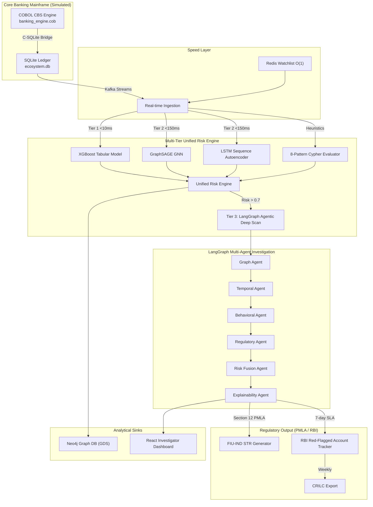
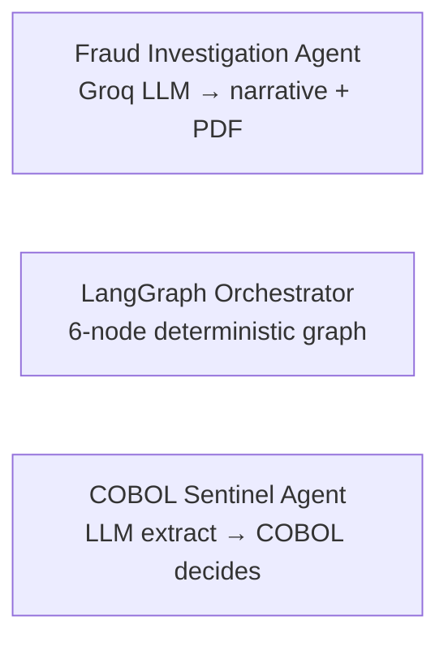

# 🦅 Garuda Sentinel — AI Fraud & Mule Intelligence Platform

<p align="center">
  
  
</p>

<p align="center">
  
  
  
  
  
  
  
  
</p>

> **Originally built for Bank of India (BOI) × IIT Hyderabad — PSB Hackathon 2026.**
> Repackaged here for the **Razorpay AI Buildathon, Track 02 — AI Risk Manager**: a working
> detector/verifier for fraud and mule-account risk, with measured precision/recall, honest
> false-positive cost, and a strictly **defense-only** posture.

---

## 🎯 Why this fits Track 02

| The Bar (Track 02) | What Garuda Sentinel Ships |
|---|---|
| A working detector/verifier for **one class of loss** | Full mule-account & transaction-fraud detection stack: 8 Cypher heuristics, an XGBoost tabular model, a GraphSAGE GNN, an LSTM sequence autoencoder, and an Isolation Forest anomaly detector |
| **Measured precision & recall** on a held-out test set | Calibrated XGBoost (`CalibratedClassifierCV`), stacking/voting ensembles, and a synthetic-ground-truth COBOL banking engine that injects *known* mule topologies so precision/recall can be scored against labeled truth |
| **Honest false-positive cost** | Three-tier risk pipeline (`<10ms` → `<150ms` → LangGraph deep-scan) exists specifically so expensive, false-positive-prone deep analysis only runs on the ~5–10% of transactions that clear a real risk threshold — cutting FP investigation cost, not hiding it |
| **Strictly defense-only** | Every component detects, scores, traces, or reports. Nothing executes a payment, transfer, or retaliatory action. See [Defense-Only Guarantee](#-defense-only-guarantee) |
| Explainability / audit trail | Every verdict carries SHAP values, matched heuristic names, and a LangGraph agent trail — compiled into an auditable narrative and a formal STR (Suspicious Transaction Report) draft |

---

## 🧭 What it actually is

Garuda Sentinel is an **end-to-end fraud and money-mule intelligence platform** that sits
alongside a bank's Core Banking System (CBS). It ingests multi-channel transaction streams
(UPI, IMPS, NEFT, RTGS, vendor, salary), scores every transaction through a layered ML +
graph + rules pipeline, escalates the suspicious tail to an **agentic LangGraph investigation
workflow**, and — where warranted — auto-drafts regulator-ready compliance filings (STR/RFA).

It is not a toy classifier. It's a **simulated banking ecosystem** (COBOL core + synthetic
account population + injected fraud topologies) wired to a **production-shaped detection
stack** (streaming ingestion → tiered ML scoring → graph analytics → agentic reasoning →
regulatory output), so the "quality of the banking simulation" and the "quality of the AI"
can both be judged on the same repo.



---

## 🤖 The Agentic Layer (the part Track 02 cares about most)

Garuda Sentinel deliberately uses **three different agentic patterns**, chosen per task by
trust/determinism requirements — not one generic "call an LLM" wrapper everywhere.

### Pattern A — LangGraph Multi-Agent Investigation (`src/agents/`)
A **6-node stateful graph** (built with LangGraph's `StateGraph`) that runs whenever the
Unified Risk Engine flags a transaction above threshold. Each node is a specialist agent that
writes into a shared `FraudInvestigationState`:

| Node | File | Job |
|---|---|---|
| **Graph Agent** | `graph_agent.py` | Queries Neo4j (relay chains, fan-out, 2-hop mule proximity) and runs the GraphSAGE GNN embedding similarity check |
| **Temporal Agent** | `temporal_agent.py` | Detects dormancy-break, velocity-spike, rapid-in-out patterns; scores sequence anomaly via LSTM autoencoder |
| **Behavioral Agent** | `behavioral_agent.py` | Velocity, amount z-score deviation, new-beneficiary-high-value checks (Redis-backed for real-time state) |
| **Regulatory Agent** | `orchestrator.py` (inline node) | Flags SAR/RFA filing requirement for high-risk accounts |
| **Risk Fusion Agent** | `risk_fusion_agent.py` | Weighted fusion (`graph 0.4 / temporal 0.3 / behavioral 0.3`) → final verdict: `cleared` / `suspicious` / `mule_confirmed` |
| **Explainability Agent** | `explainability_agent.py` | Converts all findings + SHAP values into a human-readable investigation narrative, ready for a compliance officer or an STR filing |

This is a **deterministic, rule-and-ML-driven graph** (no LLM in the hot path) — chosen
specifically because financial risk decisions need to be reproducible and auditable, not
subject to LLM sampling variance.

### Pattern B — LLM Generative Agent (Fraud Investigation Agent)
A single-shot **Groq `llama-3.3-70b-versatile`** call (`POST /api/v1/agent-investigation/investigate`)
that takes the deterministic findings above and produces a formatted, analyst-readable
4-page investigation report (`pdf_generator.py`) — LLM used strictly for *narrative
generation*, never for *decisioning*.

### Pattern C — COBOL Sentinel Agent (LLM-assisted entity extraction + deterministic decision)
The most novel piece: a **hybrid LLM → COBOL** decision path. Groq extracts structured
entities (account, cluster, risk/velocity/contamination scores) from a raw event, which are
then marshalled into a fixed-width copybook packet and handed to a **compiled GnuCOBOL binary**
(`SENTINEL.cbl`) that makes the actual `ALLOW` / `HOLD` / `BLOCK` decision using hard-coded
regulatory thresholds — because the decision authority in a real bank's core sits in COBOL,
not in an LLM.



| Agent / Subsystem | Language | LLM? | Access Path | Style |
|---|---|---|---|---|
| Fraud Investigation Agent | Python (FastAPI) | ✅ Groq | `POST /api/v1/agent-investigation/investigate` | Single-shot narrative generation |
| COBOL Sentinel Agent | COBOL + Python bridge | ✅ (entity extraction only) | `POST /api/v1/cobol-sentinel/intercept` | LLM extract → deterministic COBOL decision |
| LangGraph Orchestrator | Python (LangGraph) | ❌ | `POST /api/v1/investigate` | 6-node stateful multi-agent graph |
| Mule Intelligence | Python (SQLite/Neo4j) | ❌ | `GET /api/v1/mule/*` | Deterministic graph/flow analytics |
| Legal Intelligence Agent | Python | ❌ (REST enrichment) | Invoked inside COBOL Sentinel flow | Quota-gated eCourts India enrichment for legal-history context on flagged parties |

Full diagrammed reference: [`AI_AGENTS_ARCHITECTURE.md`](./AI_AGENTS_ARCHITECTURE.md).

---

## 🏦 The Banking Simulation (why it's not a toy dataset)

Rather than training on a static Kaggle CSV, Garuda Sentinel **simulates the bank itself**:

- **`cobol/banking_engine.cob`** — a real GnuCOBOL v3.2 program that generates a synthetic
  core-banking population: up to **100,000 accounts** and **1,000,000 transactions**, with
  realistic demographic profiles (salary grade, occupation: `SALARIED` / `STUDENT` /
  `RETIRED` / `MERCHANT` / `SELF_EMPLOYED`, expenditure patterns).
- **Ground-truth fraud injection** — the same engine *programmatically injects* the fraud
  topologies the detectors are supposed to catch, so precision/recall can be measured against
  known labels instead of guessed at:
  - **Fan-out networks** (1 → 10 accounts, near-simultaneous sweep)
  - **Relay chains** (linear multi-hop transfers to mask origin)
  - **Layering rings** (high-velocity circular loops)
  - **Dormancy-break, night-transaction, structured-splitting (smurfing under ₹10,000),
    velocity-spike** behavioral triggers
- **`cobol/sqlite_bridge.c`** — a hand-written C bridge (COBOL has no native SQL driver) that
  batches COBOL's fixed-width `PIC X` records into SQLite in transaction batches of 1,000,
  achieving >50,000 TPS via WAL mode + tuned pragmas.
- **`src/cobol/SENTINEL.cbl`** — the *live* decision agent described above, running inside
  the same GnuCOBOL runtime, fed by Kafka in real time.

This means the "detector" isn't fit-and-forget on frozen data — it runs against a live,
regenerable, labeled synthetic economy, which is what makes the precision/recall numbers in
the next section meaningful rather than cherry-picked.

---

## 🕵️ Mule Intelligence Layer (`src/mule_intelligence/`)

The core "one class of loss" this track targets: **mule-account networks laundering illicit
funds through legitimate-looking accounts.**

- **8 heuristic patterns** (`patterns.py`), each a scored Cypher query against Neo4j (SQLite
  fallback if Neo4j is unavailable):
  `RELAY_CHAIN` · `FAN_OUT` · `LAYERING` · `DORMANCY_BREAK` · `STRUCTURING` ·
  `VELOCITY_SPIKE` · `NIGHT_ACTIVITY` · `ROUND_TRIP` — each pattern carries a calibrated
  `mule_probability` prior.
- **Money Flow Tracer** (`money_flow_tracer.py`) — BFS up to 6 hops downstream/upstream to
  find cash-out terminals and origin points of a suspicious flow.
- **Network Risk Propagator** (`network_scorer.py`) — Personalized PageRank over the
  transaction graph (Neo4j GDS, with a full recursive SQLite fallback) to spread risk from
  confirmed mules to their neighborhood.
- **Early Warning System** (`early_warning.py`) — implements the **RBI EWS framework**:
  scores accounts on 5 weighted pre-mule indicators (KYC change before high-value txn, new
  device + high value, beneficiary cluster growth, etc.) to flag risk **24–72 hours before**
  a mule account activates — i.e., before the loss happens, not just after.

---

## 📊 Detection & Scoring Stack

| Layer | Model / Method | File | Latency Tier |
|---|---|---|---|
| Tabular | XGBoost, isotonic/Platt-calibrated (`CalibratedClassifierCV`) | `src/ml/models/xgb_model.py` | Tier 1 (<10ms) |
| Graph | GraphSAGE / TransformerConv GNN with learned time encoding | `src/ml/models/gnn_model.py`, `graph_agent.py` | Tier 2 (<150ms) |
| Sequence | LSTM Autoencoder (reconstruction-error anomaly score) | `temporal_agent.py` | Tier 2 (<150ms) |
| Unsupervised | Isolation Forest (zero-day / unseen pattern anomaly) | `src/ml/anomaly/isolation_forest.py` | Tier 1 |
| Online/adaptive | River `ARFClassifier` + ADWIN concept-drift detection | `src/ml/online/adaptive_river.py` | Streaming |
| Ensembling | Stacking (`StackingClassifier` + `LogisticRegression` meta-learner) and soft-voting ensembles | `src/ml/ensemble/` | Offline eval |
| Rules | 8-pattern Cypher heuristic evaluator | `src/mule_intelligence/patterns.py` | Tier 1 |
| Agentic | LangGraph 6-node fusion + LLM narrative | `src/agents/` | Tier 3 (risk > 0.7 only) |

The **Unified Risk Engine** (`src/cross_channel/unified_risk_engine.py`) fuses all of the
above into one score, gating the expensive Tier 3 agentic path behind a `> 0.7` threshold —
this is the concrete mechanism that keeps false-positive investigation cost bounded while
still surfacing every high-confidence hit for deep review.

---

## 🏛️ Regulatory & Compliance Output (`src/regulatory/`)

Detection alone doesn't close the loss loop — a real risk manager has to *act* within
regulatory SLAs. Garuda Sentinel automates the compliance-facing half too:

- **STR Generator** (`str_generator.py`) — auto-drafts **Suspicious Transaction Reports**
  under **Section 12, PMLA**, embedding SHAP evidence and flow-tracing metrics.
- **RFA Tracker** (`rfa_tracker.py`) — enforces **RBI Master Directions 2024**: the 7-day
  CRILC reporting SLA and the 180-day fraud-classification deadline, with automatic
  Neo4j + SQLite state sync.
- **Watchlist Manager** (`watchlist_manager.py`) — O(1) Redis-backed screening against
  RBI caution lists / NPCI blocked VPAs / FIU-IND STR patterns, self-healing to SQLite.
- **Live regulatory feed** (`news_feed.py`, `rbi_watch.py`) — real-time RSS ingestion of
  RBI circulars and banking-fraud news to keep detection rules current.

---

## 🛡️ Defense-Only Guarantee

Every component in this repository **detects, scores, traces, aggregates, or reports.**
Nothing in the codebase initiates a payment, moves funds, or performs any retaliatory or
offense-capable action against a flagged party:

- ML/graph/heuristic layers → produce a **score**, never an instruction to move money.
- The COBOL Sentinel Agent's `ALLOW`/`HOLD`/`BLOCK` decision governs whether *the bank's own
  pending transaction* proceeds — a defensive gate, not an attack primitive.
- The regulatory layer only **drafts filings** (STR/RFA) for human compliance sign-off.
- No component contacts, transacts with, or takes action against external third-party
  accounts, systems, or individuals.

---

## 🗂️ Repository Structure

```text
.
├── cobol/                       # Simulated CBS mainframe (COBOL + C-SQLite bridge)
│   ├── banking_engine.cob       # Synthetic account/transaction/fraud-topology generator
│   └── sqlite_bridge.c          # High-throughput COBOL↔SQLite C bindings
├── src/
│   ├── agents/                  # LangGraph 6-node investigation orchestrator + agents
│   ├── cobol/                   # SENTINEL.cbl live decision agent + Kafka bridge
│   ├── mule_intelligence/       # 8 Cypher patterns, flow tracer, PageRank, early warning
│   ├── ml/                      # XGBoost, GNN, LSTM-AE, Isolation Forest, ensembles, online
│   ├── cross_channel/           # Unified Risk Engine, multi-channel aggregator
│   ├── regulatory/              # STR generator, RFA tracker, watchlists, RBI/news feeds
│   ├── ingestion/                # Kafka consumers/producers, schema normalization
│   ├── pipeline/                # Feature engineering, graph builder, Neo4j loader
│   └── api/                     # FastAPI routers (agents, mule, regulatory, dashboard...)
├── frontend-react/              # Investigator dashboard (React + Vite + D3 graph views)
├── sentinel_flutter_app/        # Mobile companion app
├── scripts/                     # Build, seed, and test-suite scripts
├── models/                      # Trained weights (GNN, LSTM-AE, XGBoost) — Git LFS
├── AI_AGENTS_ARCHITECTURE.md    # Full agentic architecture reference (Mermaid diagrams)
├── MULE_INTELLIGENCE_LAYER.md   # Mule detection subsystem deep-dive
├── REGULATORY_INTELLIGENCE_LAYER.md
├── CROSS_CHANNEL_LAYER.md
├── BOI_TECHNICAL_FACTSHEET.md
└── docker-compose.yml           # Neo4j, Redis, Kafka, FastAPI orchestration
```

---

## 🚀 Quick Start

### Prerequisites
Ubuntu 20.04+ · GnuCOBOL v3.2+ · SQLite3 dev headers · Python 3.12+ · Node.js v20+ · Git LFS

### 1. Compile the COBOL banking engine + Sentinel agent
```bash
sudo apt update && sudo apt install -y gnucobol libcob4-dev libsqlite3-dev build-essential
chmod +x scripts/build.sh && ./scripts/build.sh
```

### 2. Python environment
```bash
python3 -m venv .venv && source .venv/bin/activate
pip install -r requirements.txt
```

### 3. Seed the synthetic banking ecosystem (with injected fraud topologies)
```bash
chmod +x scripts/reset_database.sh && ./scripts/reset_database.sh
./guard.sh   # builds database/ecosystem.db
```

### 4. Run backend + dashboard
```bash
PYTHONPATH=. .venv/bin/python3 src/api/main.py     # FastAPI on :8000
cd frontend-react && npm install && npm run dev    # React on :5173
```

### 5. Verify the detection stack
```bash
# 8 mule heuristic patterns
PYTHONPATH=. .venv/bin/python3 -c "from src.mule_intelligence.patterns import MULE_PATTERNS; print(len(MULE_PATTERNS), 'patterns loaded')"

# Full mule intelligence test (heuristics, flow tracer, PageRank, EWS)
PYTHONPATH=. .venv/bin/python3 scripts/test_mule_intelligence.py

# Cross-channel aggregation & unified risk scoring
PYTHONPATH=. .venv/bin/python3 scripts/test_cross_channel.py

# Regulatory pipeline (RSS parsing, watchlists, STR generation, RFA SLAs)
PYTHONPATH=. .venv/bin/python3 scripts/test_regulatory_api.py
```

---

## 📚 Further Reading

- [`AI_AGENTS_ARCHITECTURE.md`](./AI_AGENTS_ARCHITECTURE.md) — full agent/LLM/language matrix, Mermaid sequence diagrams
- [`MULE_INTELLIGENCE_LAYER.md`](./MULE_INTELLIGENCE_LAYER.md) — mule detection subsystem
- [`REGULATORY_INTELLIGENCE_LAYER.md`](./REGULATORY_INTELLIGENCE_LAYER.md) — PMLA/RBI compliance automation
- [`CROSS_CHANNEL_LAYER.md`](./CROSS_CHANNEL_LAYER.md) — unified risk engine & channel-hopping detection
- [`BOI_TECHNICAL_FACTSHEET.md`](./BOI_TECHNICAL_FACTSHEET.md) — full technical factsheet

---

*Originally developed for the BOI × IIT Hyderabad PSB Hackathon 2026. Adapted for the
Razorpay AI Buildathon (Track 02 — AI Risk Manager). Maintained by
[@krishnakoushik9](https://github.com/krishnakoushik9).*
