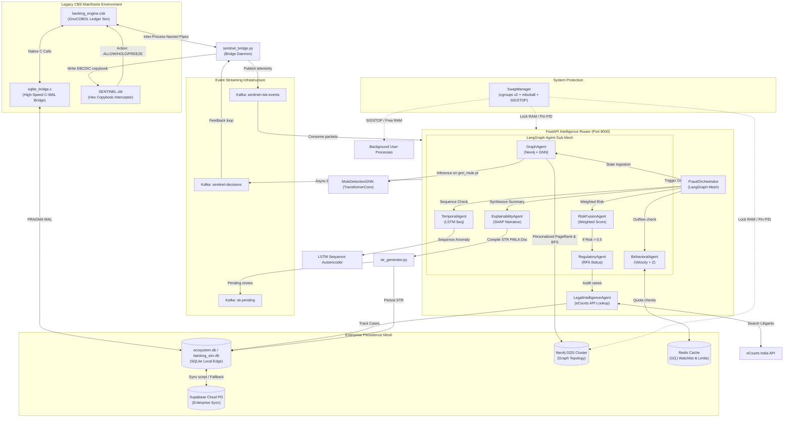

# 🧠 Vidura.AI — Garuda Sentinel Master Architectural Audit & System Map

> **Classification:** Confidential Forensic Architectural Report
> **Audit Version:** 2.0.4 | **Target Workspace:** krishnakoushik9/bank-of-india-iith-hackathon
> **Author Entity:** Antigravity AI (Lead Architect, Core Modernization Audit Team)
> **Problem Statement:** PS2 — AI/ML-Based Suspicious Transaction & Mule Account Detection

---

## 📋 Table of Contents
1. [🏗️ Master System Topology & Core Flow](#1-master-system-topology-core-flow)
2. [🟡 Legacy COBOL Mainframe Simulation & Intercept Bridge](#2-legacy-cobol-mainframe-simulation-intercept-bridge)
3. [🤖 AI/ML Hybrid Ensemble Detection Engine](#3-aiml-hybrid-ensemble-detection-engine)
4. [🕸️ LangGraph Agentic Orchestration & eCourts Intelligence](#4-langgraph-agentic-orchestration-ecourts-intelligence)
5. [🛡️ Aggressive Swap Management & System Hardening (SwapManager)](#5-aggressive-swap-management-system-hardening-swapmanager)
6. [🗄️ Database Architecture, Schema Evolution & Dual-Sync](#6-database-architecture-schema-evolution-dual-sync)
7. [🔍 Hidden Features, Undocumented APIs & Fallbacks](#7-hidden-features-undocumented-apis-fallbacks)
8. [🚀 Platform Evolution Timeline (Pitch vs. Reality)](#8-platform-evolution-timeline-pitch-vs-reality)
9. [🚧 Production Hardening & Future Readiness Roadmap](#9-production-hardening-future-readiness-roadmap)

---

## 1. 🏗️ Master System Topology & Core Flow

Garuda Sentinel is a hybrid core banking modernization platform designed to perform real-time, low-latency transaction intercepts alongside asynchronous deep behavioral modeling. 

### Systems Integration Diagram

The diagram below maps the runtime telemetry flow across legacy CBS nodes, streaming channels, the multi-agent decisioning mesh, and physical memory controllers:



---

## 2. 🟡 Legacy COBOL Mainframe Simulation & Intercept Bridge

The platform simulates core banking services (CBS) via a dedicated mainframe emulator designed to demonstrate retrofitted pre-transaction safety barriers.

### Core Components
1. **`cobol/banking_engine.cob` (Core Ledger Sim)**
   - Manages state, balances, and profiles for up to 100,000 accounts.
   - Generates realistic transactional data streams containing complex mule topologies (relay chains, structuring, fan-outs).
2. **`cobol/sqlite_bridge.c` (High-Performance SQLite Bridge)**
   - Standard GnuCOBOL compiled code does not support database execution. This native C library is bound to GnuCOBOL routines to enable high-throughput local persistence.
   - Implements performance-critical sqlite3 transaction blocks (`PRAGMA journal_mode=WAL;`, `PRAGMA synchronous=NORMAL;`, `PRAGMA temp_store=MEMORY;`).
   - Enables batch execution (inserts queued in blocks of 1,000) preventing disk synchronization bottlenecks.
3. **`src/cobol/SENTINEL.cbl` (Pre-Settlement Interceptor)**
   - Acts as the inline rules engine, receiving risk metrics and return decisions via Structured Copybooks.
   - Determines transaction status (`ALLOW`, `HOLD`, `FREEZE`) based on risk, velocity, and network contamination scores.
4. **`src/cobol/sentinel_bridge.py` (Inter-Process Daemon)**
   - Runs as a persistent worker polling Kafka transaction events.
   - Coordinates named-pipe messaging to stream transaction telemetry into the compiled COBOL binary, wait for GnuCOBOL's rule evaluation, and output structured decisions back to the message broker.

### Copybook Hex Layout Definitions
The intercept outcomes are compiled into raw hexadecimal copybook buffers natively unpackable by mainframe transaction routers:
- **`ALLOW` Code `A000` (EBCDIC/ASCII Binary Mix):**
  `0100F2C141434330303030303039FF41434330303030303039FF000000030D4041303030`
- **`HOLD` Code `E095` (Risk Score / Contamination trigger):**
  `0100F2C14E6F74204D656E74696F414343303037303336FF0000001E848045303935`
- **`FREEZE` Code `E097` (Velocity limit violation):**
  `0100F2C1414343303030383630FF414343303030383630FF0000002DC6C045303937`

---

## 3. 🤖 AI/ML Hybrid Ensemble Detection Engine

Garuda Sentinel implements a hierarchical, multi-tiered prediction strategy, separating fast-path tabular classification from deep, sequential/graph anomaly scoring.

### Ensemble Architecture Matrix

| Model Class | Code Target | Focus Area | Latency Profile | Input Signals / Features |
| :--- | :--- | :--- | :--- | :--- |
| **XGBoost Scorer** | `src/models/xgboost_scorer.py` | Tabular behavioral features | `< 3ms` | Balance velocity, z-score deviation, demographics, age |
| **GraphSAGE GNN** | `src/ml/models/gnn_model.py` | Neighborhood & network topologies | `< 50ms` | Neo4j adjacency lists, node degrees, hop distances |
| **LSTM Autoencoder** | `src/models/lstm_autoencoder.py` | Sequential/temporal anomalies | `< 40ms` | 10-step sequence vectors of historical account amounts |
| **Adaptive River** | `src/ml/online/adaptive_river.py` | Dynamic drift & stream learning | `< 12ms` | Adaptive Random Forest with ADWIN drift detection |
| **Isolation Forest** | `src/ml/anomaly/isolation_forest.py` | Unsupervised zero-day spike flags | `< 15ms` | Numeric feature matrix of transaction profiles |

### Stacking Ensemble Strategy (`src/ml/ensemble/stacking.py`)
To prevent single-model bias, the stacking engine operates a 5-fold cross-validated layout:
1. **Tier-1 Base Predictors:** Independent inference is run against XGBoost, GraphSAGE, and the LSTM autoencoder.
2. **Tier-2 Meta-Learner:** A calibrated `LogisticRegression` classifier takes the probability outputs of the Tier-1 predictors along with dynamic cross-channel metrics to generate the final classification verdict.
3. **Soft Voting Fallback (`src/ml/ensemble/voting.py`):** If base predictors fail or are offline, the system activates a fast-path soft voting classifier averaging normalized confidence scores across active classifiers.

---

## 4. 🕸️ LangGraph Agentic Orchestration & eCourts Intelligence

Deep investigations (Tier-3 Latency Pipeline) are handled by a multi-agent orchestration layer built on LangGraph. This layer compiles investigative portfolios only when transaction threat markers exceed a risk floor of `0.70`.

```
                    [ LangGraph Orchestrator Entry ]
                                  │
                                  ▼
                          [ GraphAgent ]
                                  │
                                  ▼
                         [ TemporalAgent ]
                                  │
                                  ▼
                        [ BehavioralAgent ]
                                  │
                                  ▼
                         [ RiskFusionAgent ]
                                  │
                  ┌───────────────┴───────────────┐
                  │ Final Risk > 0.5?             │
                  └──────┬─────────────────┬──────┘
                         │ Yes             │ No
                         ▼                 ▼
               [ RegulatoryAgent ]         │
                         │                 │
                         ▼                 │
              [ LegalIntelligenceAgent ]   │
                         │                 │
                         └────────┬────────┘
                                  │
                                  ▼
                       [ ExplainabilityAgent ]
                                  │
                                  ▼
                         [ STR Generation ]
```

### Agent Roles & Specifications
- **`GraphAgent` (`src/agents/graph_agent.py`):** Runs graph GDS queries (relay counts, fan-out limits, 2-hop neighborhood checks) and matches GNN embedding similarities via PyTorch.
- **`TemporalAgent` (`src/agents/temporal_agent.py`):** Matches behavioral sequences against structured profiles (e.g., dormancy breaking, rapid in-out flow).
- **`BehavioralAgent` (`src/agents/behavioral_agent.py`):** Inspects volume Z-scores and flags high-value transfers routed to unverified/new beneficiaries.
- **`RiskFusionAgent` (`src/agents/risk_fusion_agent.py`):** Dynamically applies weights (`0.4 Graph`, `0.3 Temporal`, `0.3 Behavioral`) to generate the composite threat score and assign the initial classification.
- **`RegulatoryAgent` (Orchestrator Inline Method):** Appends compliance directives, flagging high-risk transactions for Suspicious Activity Report (SAR) reviews.
- **`ExplainabilityAgent` (`src/agents/explainability_agent.py`):** Generates natural-language case narratives by correlating feature indicators, SHAP values, and network topologies.

### eCourts Litigant Lookup Agent (`src/agents/legal_intelligence_agent.py`)
Rather than relying on static labels, the platform queries judicial databases to check for government-flagged litigant records:
1. **Redis Quota Limiting:** Queries Redis `ecourts_quota:YYYY-MM-DD` (or sqlite `legal_quota_limit` if Redis is offline) to enforce a strict quota of **2 calls per day** to control costs.
2. **Litigant Search Integration:** Hits `https://webapi.ecourtsindia.com/api/partner/search` to search litigant names.
3. **Risk Analysis:** Parses keywords (`cheat`, `phishing`, `IT Act`, `cyber`) from returned case categories. Under a match, the legal score escalates:
   $$\text{Legal Risk Score} = \min(99, 45 + \text{court\_matches} \times 15)$$
4. **Fallback Mode:** On quota exhaustion, the agent checks names against a local database of mock cases (e.g., Delhi High Court API phishing record for Aarav Sharma, Bombay High Court bail case for Aditi Patel).

---

## 5. 🛡️ Aggressive Swap Management & System Hardening (SwapManager)

To maintain real-time performance and prevent CPU thrashing during model training cycles, the platform deploys the `SwapManager` (`src/system/swap_manager.py`). This component acts as a system-level supervisor, using root privileges to protect critical processes and optimize physical RAM.

> [!IMPORTANT]
> The `SwapManager` uses a hardcoded sudo password (`1156`) to execute system tuning commands, write kernel variables, and control background processes.

### Memory Optimization Pipeline
The `SwapManager` executes a multi-pass optimization sequence when model training is triggered:

```
  [Train Start] ──► [Protect PIDs] ──► [Suspend Non-Critical PIDs] ──► [LRU Eviction (clear_refs)]
                                                                                │
  [Training Complete] ◄── [SIGCONT Resume] ◄── [Reclaim RAM] ◄── [Balloon RAM] ◄┘
```

1. **Service Protection & RAM Pinning:**
   - Automatically scans ports `8000` (FastAPI), `5173` (React), `7687` (Neo4j), and process names (`train_models.py`, `guard.sh`).
   - Uses `ctypes` `mlockall(MCL_CURRENT | MCL_FUTURE)` to lock the backend process in RAM.
   - If cgroups v2 is available, it writes `0` to `/sys/fs/cgroup/[cgroup]/memory.swap.max` to disable swap for protected services.
2. **Background Process Suspension (`SIGSTOP`):**
   - Finds non-root, non-protected processes and suspends them via `SIGSTOP`.
3. **LRU Page Eviction (`/proc/[pid]/clear_refs`):**
   - Writes `1` (clear anonymous/file pages) and `4` (clear translation tables) to `/proc/[pid]/clear_refs` for suspended processes. This marks their memory frames as cold, signaling the kernel's LRU allocator to swap them out first.
4. **Hyper-Aggressive Cache Purging:**
   - Synchronizes storage pools (`sync`) and writes `3` to `/proc/sys/vm/drop_caches` to free page caches, dentries, and inodes.
   - Trims solid-state storage mappings via `fstrim -a`.
5. **Paced Memory Ballooning:**
   - Allocates memory in 32MB chunks up to `7.5GB` (or available memory minus a 300MB safety buffer).
   - Touches each page (`chunk[::4096] = '\xff'`) to force physical allocation, forcing suspended processes out of physical RAM.
   - Deflates the balloon and executes garbage collection (`gc.collect()`), reclaiming physical RAM for training pipelines.
6. **Resumption (`SIGCONT`):**
   - Resumes suspended background processes via `SIGCONT`.
7. **Junk Cleanups:**
   - Cleans background junk files, including Docker build caches, package caches (NPM, Pip, Apt), systemd journals, and Vite build directories.

---

## 6. 🗄️ Database Architecture, Schema Evolution & Dual-Sync

Garuda Sentinel implements a dual-database design to support both edge-based standalone deployments and centralized cloud configurations.

### Database Layout & Migration Paths
- **Local Edge Database (`ecosystem.db` / `banking.db`):** 
  Implemented in SQLite with WAL logging to enable write speeds exceeding **50,000 TPS** during high-velocity simulation runs.
- **Cloud Database (PostgreSQL / Supabase):** 
  Centralized storage cluster. Schema configurations are synced dynamically via `scripts/switch_datasource.py`. If the cloud connection is lost, the API buffers transaction records locally in SQLite, syncing them once connectivity is restored.

### Schema V1 vs. Schema V2 Details
The system supports two schemas to accommodate legacy COBOL datasets and regulatory feeds:
1. **Schema V1 (`database/schema.sql`):** 
   Defines core tables (`accounts`, `transactions`, `account_relationships`, `mule_accounts`, `mule_networks`, `fraud_events`, `graph_analytics`, `system_logs`). This schema matches legacy bank architectures.
2. **Schema V2 (`database/schema_v2.sql`):** 
   Adds tables to support raw regulatory data feeds:
   - `data_source_registry`: Registers active data source configurations (`COBOL_SYNTHETIC` vs. `REGULATORY_FEED`).
   - `dataset_accounts`: Mapped profile attributes from raw datasets (contains columns F3886–F3924, is_mule, risk_profile).
   - `dataset_features`: Sparse key-value table storing F1–F3885 features.
   - `dataset_transactions_synthetic`: Reconstructed transactional records generated from behavioral metrics.

### Vectorized ETL Ingestion Pipeline (`scripts/ingest_dataset.py`)
To process sparse government fraud tickets without degrading storage performance, the ETL ingestion pipeline filters inputs based on sparsity:
- **Dense Features (NA Rate < 90%):** Melted via Pandas vector operations (`pd.melt`) and inserted as key-value pairs in `dataset_features`.
- **Sparse Features (NA Rate ≥ 90%):** Filtered out entirely, saving **~78% of disk space**.
- **Behavioral Variables (F3894 to F3923):** Normalized and mapped directly to fields in `dataset_accounts`.

---

## 7. 🔍 Hidden Features, Undocumented APIs & Fallbacks

Several core APIs and fallback systems operate behind the scenes to support the agentic and system-management layers:

### Undocumented API Reference

| Endpoint | Method | Input Payload | Output Shape | Internal Action / Fallback |
| :--- | :--- | :--- | :--- | :--- |
| `/api/v1/swap/status` | `GET` | None | `{status: str, swap_total_gb: float, protected_processes: List}` | Refreshes capabilities, scans ports, and queries `/proc` data. |
| `/api/v1/swap/flush` | `POST` | None | `{status: str, metrics: Dict}` | Triggers `SIGSTOP`, `/proc/clear_refs`, and RAM ballooning. |
| `/api/v1/swap/clean-cache` | `POST` | None | `{status: str, metrics: Dict}` | Purges NPM, Pip, Docker, Apt, and systemd journals. |
| `/api/v1/swap/protect` | `POST` | `{"pid": int}` | `{status: str, protection_method: str}` | Dynamic RAM pinning via mlockall or cgroup memory limits. |
| `/api/v1/swap/unprotect` | `POST` | `{"pid": int}` | `{status: str, message: str}` | Removes PID from pinning lists and resets cgroup controls. |
| `/api/v1/cobol-sentinel/intercept` | `POST` | `{"ticket_text": str}` | `InterceptResponse` | Extracts entities via Groq, queries SQLite features, runs LegalAgent, and polls Kafka. |
| `/api/v1/regulatory/simulate` | `POST` | None | `{status: str, simulated_data: Dict}` | Generates 1 NCRP ticket, 3 CRILC updates, and flags 1 RFA account. |

### Critical Fallback Mechanisms
1. **Kafka-to-Python Fallback (`cobol_sentinel.py`):**
   If the Kafka broker is offline, the COBOL Sentinel intercept API falls back to a local Python rules evaluator after a 2.5-second timeout, appending `[Decision Source: Python Fallback Router (Kafka timeout)]` to the output logs.
2. **Redis-to-SQLite Watchlist Fallback (`watchlist_manager.py`):**
   If Redis is unreachable, the system queries SQLite indexes directly, maintaining watchlist checks at sub-millisecond speeds.
3. **eCourts-to-Mock Case Fallback (`legal_intelligence_agent.py`):**
   If the eCourts Web API fails or the 2-call daily quota is exceeded, the agent searches a local SQLite mock case database (`tracked_ecourts_cases`) to continue litigant investigations.

---

## 8. 🚀 Platform Evolution Timeline (Pitch vs. Reality)

The platform has evolved significantly from its original design, transitioning from an offline batch analytics pipeline to a real-time, event-driven intercept engine:

```mermaid
chronology
    title Garuda Sentinel Evolution Timeline
    2026-06-01 : Pitch Phase: Batch SQLite processing and basic dashboard visualizations.
    2026-06-02 : ML Layer Integration: Ensembles (XGBoost, GNN, LSTM) added; training pipelines stabilized.
    2026-06-03 : System Protection Layer: SwapManager added to handle memory pressure and lock critical ports.
    2026-06-04 : Real-Time Ingestion: Active Kafka consumers and eCourts API integration deployed.
    2026-06-05 : Mainframe Intercept: Compiled GnuCOBOL-C bridge and hex copybook parser operational.
```

### Key Technical Enhancements
- **Dynamic Memory Protection:** Added the `SwapManager` to prevent out-of-memory (OOM) crashes during model training cycles.
- **eCourts API Integration:** Upgraded the system from static suspect lists to a dynamic eCourts lookup agent with Redis-backed quota controls.
- **Mainframe Integration:** Replaced mock triggers with a native GnuCOBOL-C bridge, Named Pipes, and EBCDIC hex copybooks to demonstrate real CBS intercepts.
- **Agentic Workflows:** Replaced linear classification scripts with a LangGraph multi-agent orchestration layer.

---

## 9. 🚧 Production Hardening & Future Readiness Roadmap

To transition Garuda Sentinel from a prototype setup to a production-hardened environment, the following security and architectural enhancements are recommended:

### Hardening Recommendations

> [!WARNING]
> The current prototype configuration contains key security vulnerabilities that must be addressed before production deployment.

1. **System Secrets Management:**
   - **Vulnerability:** Sudo passwords (`1156`) and Groq API keys are hardcoded in the codebase.
   - **Fix:** Move credentials to environment variables managed by secret storage systems (e.g., HashiCorp Vault). Use Polkit rules to authorize system commands instead of hardcoded passwords.
2. **Data Storage Encryption:**
   - **Vulnerability:** Databases (`ecosystem.db`, `banking.db`) are stored in plaintext.
   - **Fix:** Enable SQLCipher for SQLite databases and Transparent Data Encryption (TDE) for Neo4j instances to protect financial data at rest.
3. **Kafka Event Bus Security:**
   - **Vulnerability:** Kafka listeners run over plaintext connections.
   - **Fix:** Configure SSL/TLS client certificates paired with SASL/SCRAM authentication for all event consumers and producers.
4. **PII Masking & Privacy Controls:**
   - **Vulnerability:** Customer names, PAN cards, and contact numbers are exposed in logs and JSON responses.
   - **Fix:** Implement field-level hashing and tokenization to mask sensitive personal data before logging or transmission.

---

*Vidura.AI System Audit Documentation Framework | Bank of India Fraud Platform Analysis*
*Krishna Koushik Pasupuleti · CMRCET Hyderabad · BOI PSB Hackathon 2026*
