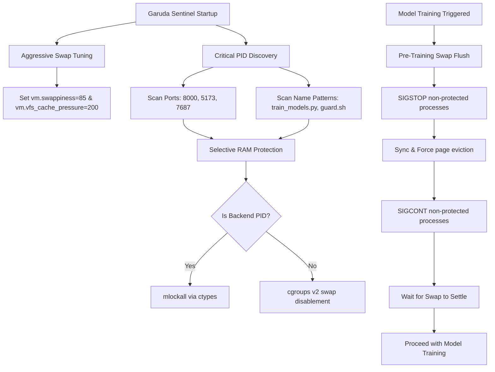

# Aggressive Swap Management & Selective RAM Protection System

## Overview

Garuda Sentinel includes high-intensity AI/ML workloads (XGBoost anomaly scoring, GraphSAGE relation extraction, and LSTM Autoencoder sequence prediction) that run alongside critical real-time application services. These workloads compete for physical RAM. 

To prevent memory exhaustion and thrashing while protecting the responsiveness of vital operational components, Garuda Sentinel features an **Aggressive Swap Management System with Selective RAM Protection**. This subsystem aggressively offloads non-critical, idle background processes into Linux system swap (leveraging a 20 GB swap pool) while pinning critical operational PIDs (FastAPI API backend, React dashboard, Neo4j, Redis) in physical RAM.

---

## Architecture & Design



### Components

1. **Swap Manager (`src/system/swap_manager.py`)**: Core manager handling capabilities detection, aggressive kernel tuning, RAM locking, and background metrics collection.
2. **Process Scanner (`src/system/process_scanner.py`)**: Resolves service ports (e.g., 8000, 5173, 7687) and name patterns into active process IDs (PIDs) using native python APIs and shell tool fallbacks (`lsof`, `ss`).
3. **API Router (`src/api/routers/swap.py`)**: Exposes REST interfaces to control, monitor, and manually configure protected processes.
4. **Train Trigger (`src/ml/train_trigger.py`)**: Pre-training hook that suspends background workloads, triggers the kernel page eviction routine, and pauses until swap I/O stabilizes prior to training.
5. **Startup Setup Script (`scripts/swap_setup.sh`)**: Performs one-time persistent system-level setup for sysctl settings, cgroups v2 memory controls, and user limits.

---

## Configuration (`config.yaml`)

Configuration is declared in the root `config.yaml` file:

```yaml
swap_manager:
  enabled: true
  swappiness: 85                  # Force aggressive eviction of idle memory (0-100)
  cache_pressure: 200             # Reclaim filesystem cache structures aggressively
  protect_ports: [8000, 5173, 7687] # Critical services ports (FastAPI, React, Neo4j)
  protect_names: ["train_models.py", "guard.sh"] # Critical CLI process names
  swap_threshold_percent: 80       # Threshold to trigger critical system alerts
  monitor_interval_seconds: 60     # Background checking interval (seconds)
  flush_on_train: true            # Trigger swap-flush automatically on model training
```

---

## Setup & System Administration

To run the swap manager with maximum efficiency (allowing non-root memory locking and persistent settings), execute the setup script once:

```bash
sudo ./scripts/swap_setup.sh
```

### Sudo Privileges and Limits Explained
1. **Sysctl Parameters**: The script adds `vm.swappiness=85` and `vm.vfs_cache_pressure=200` to `/etc/sysctl.conf` to configure aggressive swap persistence across system reboots.
2. **User Memory Locking Limits (`memlock`)**: It updates `/etc/security/limits.conf` to set `soft/hard memlock unlimited`. This permits the non-privileged python application (running under a standard user account) to execute `mlockall` successfully.
3. **cgroups v2 Swap Controller**: It activates the `memory` controller inside Linux's cgroups v2 tree to allow disabling swap selectively for individual background services.

---

## API Documentation

All endpoints reside under `/api/v1/swap`.

### 1. Get Swap Status
* **Endpoint**: `/api/v1/swap/status`
* **Method**: `GET`
* **Description**: Returns total/used swap, system capabilities, top swap consuming processes, and active protected PIDs with their memory profiles.

### 2. Trigger Manual Swap Flush
* **Endpoint**: `/api/v1/swap/flush`
* **Method**: `POST`
* **Description**: Suspends non-critical workloads, syncs filesystem buffers, forces page cache eviction, resumes workloads, and returns reclamation statistics.

### 3. Add Dynamic RAM Protection
* **Endpoint**: `/api/v1/swap/protect`
* **Method**: `POST`
* **Payload**: `{"pid": <integer>}`
* **Description**: Dynamically adds a custom PID to the protection list and immediately locks its pages in RAM.

### 4. Remove Dynamic RAM Protection
* **Endpoint**: `/api/v1/swap/unprotect`
* **Method**: `POST`
* **Payload**: `{"pid": <integer>}`
* **Description**: Removes custom PID from protection list and re-enables swap.

---

## Testing & Validation

### Phase 1: Startup Validation
1. Launch the FastAPI backend:
   ```bash
   python -m uvicorn src.api.main:app --host 0.0.0.0 --port 8000
   ```
2. Verify startup logs. You should see:
   ```text
   INFO:SwapManager:Tuning kernel: swappiness=85, vfs_cache_pressure=200...
   INFO:SwapManager:Successfully tuned vm.swappiness to 85.
   INFO:SwapManager:Successfully tuned vm.vfs_cache_pressure to 200.
   INFO:SwapManager:Discovered critical port 8000 running on PID 12345
   INFO:SwapManager:Locked backend process PID 12345 in RAM using mlockall.
   INFO:SwapManager:Background Swap Monitor successfully started.
   ```

### Phase 2: Status & Memory Check
1. Fetch the swap status:
   ```bash
   curl http://localhost:8000/api/v1/swap/status
   ```
2. Verify that `capabilities` show `has_mlock_privilege: true` and the backend PID is present in `protected_pids`.

### Phase 3: Model Training Swap Flush
1. Trigger model training via the dashboard or a POST request:
   ```bash
   curl -X POST http://localhost:8000/api/v1/mule/models/train
   ```
2. Watch backend terminal logs:
   ```text
   INFO:TrainTrigger:Flushing non-critical processes to swap before training...
   INFO:SwapManager:Suspended 12 background processes.
   INFO:SwapManager:Resumed 12 processes.
   INFO:SwapManager:Waiting for swap I/O to settle...
   INFO:SwapManager:Settle Check: si=0, so=0
   INFO:SwapManager:Swap flush completed. Evicted 120.45 MB into swap.
   ```
3. Run `free -h` to verify active swap usage.
4. Verify that protected processes have `Swap: 0 kB` inside their smaps file:
   ```bash
   grep -i swap /proc/$(pgrep -f "main:app")/smaps | uniq
   ```

### Phase 4: SSE Alerts Integration
1. If swap pool usage exceeds 80%, or if a protected PID experiences memory leakage into swap, the background monitor automatically dispatches a critical alert:
   ```text
   data: {"event_id": "FE-SWAP-d8e20f", "transaction_id": "N/A", "account_id": "N/A", "fraud_type": "swap_manager", "description": "Protected PID 12345 (python) found in swap: 1024 kB! Attempting re-protection.", "severity": "CRITICAL", "timestamp": "2026-06-02T20:10:00"}
   ```

---

## Troubleshooting

### Issue 1: `mlockall` fails with PermissionError
* **Cause**: The user running the Python process does not have `RLIMIT_MEMLOCK` privileges.
* **Resolution**: Run `sudo ./scripts/swap_setup.sh` and ensure you restart the shell session / services to apply the `/etc/security/limits.conf` changes. You can check limits using `ulimit -l`. It should display `unlimited`.

### Issue 2: vmstat settlement timeouts
* **Cause**: Heavy disk I/O or background logging operations.
* **Resolution**: Adjust `monitor_interval_seconds` in `config.yaml` or increase timeout parameter inside `src/system/swap_manager.py`.

### Issue 3: cgroups v2 controllers missing
* **Cause**: Legacy Linux kernel or cgroups v1 compatibility mode.
* **Resolution**: The system automatically falls back to system-wide swappiness tuning and best-effort `mlockall` memory locking. No manual operation is required.
