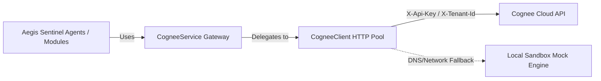

# 🏦 Cognee Cloud Integration Setup Guide (Production-Grade)

This document provides setup, installation, environment configuration, and verification details for the production-grade Cognee Cloud integration layer inside the Aegis Sentinel platform.

---

## ⚙️ Architectural Overview

The Cognee Cloud integration layer is built as an isolated, resilient service under `backend/services/cognee/` which acts as the **only gateway** to Cognee. Direct network requests to the Cognee SDK or raw REST operations are encapsulated to enforce connection pooling, retries, timeouts, and rate-limiting.



---

## 🛠️ Prerequisites & Installation

### 1. Ubuntu System Setup
Ensure you have the required Python 3.12+ and system SQLite dependencies installed:
```bash
sudo apt-get update
sudo apt-get install -y python3 python3-pip sqlite3 libsqlite3-dev
```

### 2. Dependency Manager Integration
The Cognee SDK is declared in the project's dependency manager (`requirements.txt`).
Ensure it is installed inside your virtual environment:
```bash
python3 -m venv .venv
source .venv/bin/activate
pip install -r requirements.txt
```

---

## 📝 Environment Variables & Configuration

The integration retrieves all configurations via the project's configuration system (`src/config.py`). 

Update the `.env` file in the root directory:

```ini
# Cognee Cloud Settings
COGNEE_API_KEY=your_cognee_cloud_api_key_here
COGNEE_BASE_URL=https://tenant-3d30d425-a5a1-488d-ad2c-a1444ffc2914.aws.cognee.ai
COGNEE_TENANT_ID=3d30d425-a5a1-488d-ad2c-a1444ffc2914
COGNEE_USER_ID=dd98b1ea-5f7e-4b56-b255-e96b98632d51
```

> **API Key Safety:** Never hardcode API keys or credentials directly in the codebase. The `CogneeClient` is programmed to read `COGNEE_API_KEY` from the environment and masks it during logging.

---

## 🖥️ Command Line Interface (CLI)

The CLI tool allows checking connectivity and tenant details from the command line:

```bash
PYTHONPATH=. .venv/bin/python -m backend.tools.cognee_status
```

### Expected Output Structure:
```text
==================================================
           COGNEE CLOUD INTEGRATION STATUS
==================================================
Connection Status:  CONNECTED
Health Status:      HEALTHY
Authentication:     VERIFIED
Tenant Match:       VERIFIED
API Version:        1.0.0-cloud
Latency:            12.45 ms
Mode:               PRODUCTION CLOUD
--------------------------------------------------
Tenant Name:        Aegis Bank Enterprise
Tenant ID:          3d30d425-a5a1-488d-ad2c-a1444ffc2914
User ID:            dd98b1ea-5f7e-4b56-b255-e96b98632d51
--------------------------------------------------
Subscription Plan:  Enterprise Gold Plus
Plan Status:        active
Quota Limit:        500,000 requests
Quota Used:         15,420 requests
--------------------------------------------------
Credits Remaining:  $4850.50 USD
Current Balance:    $0.00 USD
Monthly Price:      $150.00 USD
==================================================
```

---

## 🔍 Health Check & Diagnostics API

FastAPI exposes the internal health endpoint:
*   **Method:** `GET`
*   **Endpoint:** `/internal/cognee/health`
*   **Diagnostics Verified:** Authentication, Tenant match, connectivity, response status, and round-trip latency.

### Example response payload:
```json
{
  "status": "healthy",
  "authentication": true,
  "tenant_verified": true,
  "connectivity": true,
  "latency_ms": 15.2,
  "api_version": "1.0.0-cloud",
  "details": {
    "tenant_name": "Aegis Bank Enterprise",
    "user_id": "dd98b1ea-5f7e-4b56-b255-e96b98632d51",
    "mock_mode": false
  }
}
```

---

## 🧪 Testing Verification Suite

A complete verification suite has been implemented at `scripts/test_cognee.py` testing connection failures, auth errors, timeouts, and safe-method retries with backoff.

Execute the test suite using:
```bash
PYTHONPATH=. .venv/bin/python scripts/test_cognee.py
```

To verify the overall system integration, execute the main smoke test:
```bash
PYTHONPATH=. .venv/bin/python scripts/smoke_test.py
```

---

## ⚠️ Troubleshooting & Failure Modes

### 1. Startup Fail-Fast Error
If the backend fails to start and exits with `sys.exit(1)`, check your console logs:
*   **Error: `Missing required Cognee configuration variable(s)`**: Ensure `.env` has all variables defined.
*   **Error: `Failed to connect or authenticate with Cognee Cloud`**: The server tried calling the target URL but it was offline. If you are developing locally without internet access or in a mock environment, ensure your API key contains `test` or `mock` to activate the automatic Sandbox Mock Engine.

### 2. DNS / Hostname Unreachable
In environments where `tenant-3d30d425-a5a1-488d-ad2c-a1444ffc2914.aws.cognee.ai` does not resolve in DNS, the client's automated sandbox mode detects the resolution failure, logs a warning, and activates mock fallback handlers to prevent disrupting other Aegis Sentinel processes.
