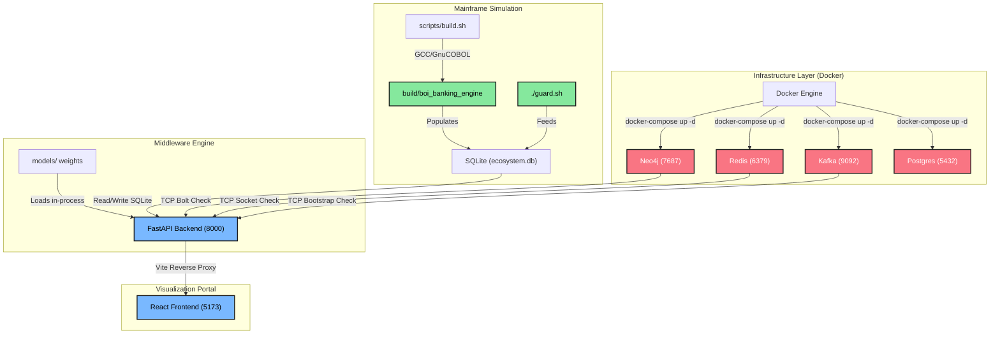

# 🦅 BOI GARUDA SENTINEL — Launcher Documentation & Architecture

This document outlines the architecture, setup, and operations manual for the **BOI Garuda Sentinel**, the master control panel and unified launcher for the Bank of India (BOI) Fraud Intelligence Platform (FDS v5.0).

---

## 🧭 Phase 1: Repository Discovery & Audit Findings

Following a complete audit of the platform repository, the actual operational entries, configurations, and health parameters are identified as follows:

### 1. Ports & Entrypoints
*   **FastAPI Backend Core**: Port `8000`. Starts via `src/api/main.py` which runs a Uvicorn container:
    ```bash
    PYTHONPATH=. .venv/bin/python3 src/api/main.py
    ```
*   **React Frontend Dashboard**: Port `5173`. Starts via Vite development server:
    ```bash
    cd frontend-react && npm run dev
    ```
*   **Vanilla Frontends (Legacy Fallback)**:
    *   **Marketing Page**: Port `3001` (served via `python3 -m http.server 3001 --directory frontend/marketing`)
    *   **Analyst Dashboard**: Port `3002` (served via `python3 -m http.server 3002 --directory frontend/dashboard`)
*   **Neo4j Database**: HTTP Console on `7474`, Bolt connector on `7687`.
*   **Redis Cache**: Port `6379`, Redis Stack Insight Console on `8001`.
*   **Kafka Event Broker**: Port `9092` (Bootstrap Server).
*   **PostgreSQL Store**: Port `5432` (Transactional relational warehouse).

### 2. Startup Flows & Initializations
*   **AI Models**: PyTorch and XGBoost layers (e.g. `xgb_fraud.json`, `gnn_mule.pt`, `lstm_ae.pt`) are loaded in-process inside the FastAPI app during startup. They do not run as standalone processes but are evaluated on-the-fly inside the `UnifiedRiskEngine`.
*   **COBOL Mainframe Simulation**: Compiled using `scripts/build.sh` (linking `cobol/sqlite_bridge.c` and `cobol/banking_engine.cob`) into a native executable `build/boi_banking_engine`. It runs asynchronously alongside `./guard.sh` which executes the advanced graph-first generator `backend/ecosystem.py` and feeds the SQLite engine (`database/ecosystem.db`).

---

## 📊 Phase 2: Startup Dependency Graph

The platform operates as a multi-tier Speed and Intelligence layer. Below is the precise startup order managed by the launcher:



### Optimal Startup Order:
1.  **Host Check**: Validate local prerequisites (`java`, `python3`, `node`, `npm`, `docker`).
2.  **Legacy Compile**: Build the legacy COBOL CBS Simulator via `scripts/build.sh` (produces `build/boi_banking_engine`).
3.  **Containers**: Spin up the Docker stack (`docker-compose up -d`).
4.  **Backend Core**: Spin up FastAPI on port `8000` (connects to SQLite, Redis, Neo4j, and Kafka).
5.  **Simulation Flow**: Initiate continuous simulated data feeds using `guard.sh`.
6.  **Analyst Portal**: Spin up the React development server on port `5173`.
7.  **SLA Health checks**: Periodically monitor open sockets and HTTP status codes to update the operations console.

---

## 🛠️ Phase 3: Project Structure & Compilation

The Garuda Sentinel is built as a highly robust, single-source Java 21 desktop application utilizing Swing for reliable cross-platform compatibility and FlatLaf for custom enterprise dark-mode styling.

### 1. Project Directory Layout
```text
BOI/
├── launcher/
│   ├── pom.xml                                      # Maven project configuration
│   └── src/
│       └── main/
│           └── java/
│               └── com/
│                   └── boi/
│                       └── launcher/
│                           └── GarudaSentinelLauncher.java  # Master Launcher Source
├── run_launcher.sh                                  # Unified execution entry script
└── launcher_documentation.md                         # This architecture guide
```

### 2. Build & Packaging Instructions
To compile and package the master launcher into a single executable FAT JAR, run these commands:

```bash
# Navigate to launcher directory
cd launcher

# Compile, assemble dependencies and build shaded fat jar
mvn clean package
```

The resulting package will be generated at:
`launcher/target/garuda-sentinel-launcher-1.0.0.jar`

This is a **shaded JAR** containing all styling assets and library components (FlatLaf), meaning it is the **only** file required to run the launcher on any system with Java 21+ installed.

### 3. Unified Execution
You can start the GUI launcher instantly with the provided root shell script:

```bash
# From root workspace
chmod +x run_launcher.sh
./run_launcher.sh
```

---

## ⚙️ Modular Service Control & COBOL Configurator

Version 5.1 introduces micro-service isolation and granular runtime parameters directly within the launcher workspace:

### 1. Isolated Service Launchers (Card Control Panels)
Instead of forcing a full platform boot sequence, each status card is now equipped with standalone `[ ▶ Start ]` and `[ ■ Stop ]` control buttons:
* **React Frontend**: Boots or stops the Node/Vite development server (`npm run dev`) independently.
* **FastAPI Backend**: Spawns or kills the Uvicorn middleware process.
* **AI Models**: Triggers background model training pipelines (`scripts/train_models.py`) on demand, logging training cycles directly to the live stream.
* **Neo4j / Redis / Kafka**: Directs targeted Docker instructions (`docker compose up -d <service>` / `docker compose stop <service>`) to start or stop container dependencies in isolation.
* **COBOL**: Opens a specialized visual configuration interface.

### 2. Deep COBOL Mainframe Configurator & Real-time SQLite Metrics
Clicking `[ ▶ Start ]` on the **COBOL** card opens an advanced operation panel:
* **Live File Scanner**: Automatically queries the active `database/ecosystem.db` SQLite engine to display the **exact number of existing accounts and transactions** currently written in the transactional warehouse.
* **Dual Boot Modes**:
  1. **Run Simulation (Generate New)**: Accepts user-defined bounds for target accounts, transactions, and generator velocities (`BOI_ACCOUNTS`, `BOI_TRANSACTIONS`, `BOI_SPEED`) to spawn fresh, real-time transaction streaming.
  2. **Start Service (No New Generation)**: Instantly marks the COBOL engine as **ONLINE** without generating new transactions, allowing baked-in frontends to query existing records in static exposure mode.

---

## 💡 Key Architectural Improvements over `run_demo.sh`

The **BOI Garuda Sentinel Launcher** provides immense utility and stability over the legacy bash scripts:

| Feature | Legacy `run_demo.sh` | Garuda Sentinel Launcher |
| :--- | :--- | :--- |
| **User Interface** | Terminal output (cluttered, requires active console). | Elegant, high-fidelity dark-themed Java GUI. |
| **Subsystem Health** | Blind sleep checks (2 seconds wait, no validation). | Continuous real-time polling (HTTP requests & Socket ping). |
| **Prerequisite Check** | None. Fails silently or crashes mid-way. | Pre-flight validation of Java, Python, Node, npm, and Docker. |
| **Docker Integration**| Ignores container health or requires manual compose up. | Integrates container stack starting and automated down. |
| **Real-time Logging** | Redirects to static files (`backend.log`, `dashboard.log`). | Central scrolling console with live text stream. |
| **Log Filtering** | No option (must tail separate log files). | Checkbox filters to isolate Backend, Frontend, or Sim feeds. |
| **Process Monitoring**| Hard to track zombie background PIDs. | ProcessBuilder handles with automatic crash/exit logging. |
| **Graceful Exit** | Trap-based exit (can leak background servers). | Safe shutdown sequence, prompt on closing, deletes stop files. |

---

## 🛡️ Hackathon Demonstration Guide

When showing this platform to the judges or audience, the launcher serves as the main command center:
1.  **Launch Launcher**: Run `./run_launcher.sh`. The audience will be wowed by the modern, styled cyber-operations screen.
2.  **Verify Setup**: Point out that the tool verifies prerequisites and looks for pre-trained weights (`models/xgb_fraud.json`, `models/gnn_mule.pt`, `models/lstm_ae.pt`) on disk.
3.  **Boot Platform**: Click the green **[ START PLATFORM ]** button. The console will print compiler and container streams in real-time, and you will see the status cards transition from red `OFFLINE` -> yellow `STARTING` -> green `ONLINE` as ports become active.
4.  **Open Analyst Portal**: Once the FastAPI backend is ready, click **[ OPEN ANALYST PORTAL ]** to automatically load the modern React web console in the default web browser.
5.  **Shutdown**: When the demonstration is finished, click the red **[ SHUTDOWN SERVICES ]** button to cleanly terminate background threads, stop the simulation, and spin down Docker containers, keeping the system clean.
